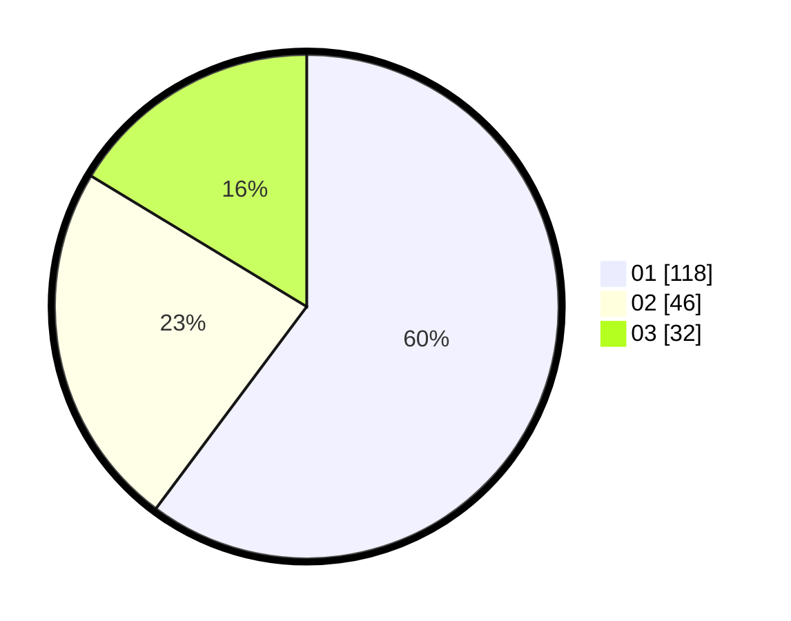

# Hasil

Hasil perolehan suara paslon dapat dilihat pada file paslon-01.txt, paslon-02.txt, dan paslon-03.txt.

Jika tidak ada, artinya data tersebut belum ada pada SIREKAP.

## Perolehan Suara

 * Paslon 01: **118**.
 * Paslon 02: **46**.
 * Paslon 03: **32**.

## Foto C Plano

https://sirekap-obj-formc.kpu.go.id/6be0/pemilu/ppwp/31/74/01/10/01/3174011001016-20240214-190837--b462dfdd-69b1-4cfa-91f7-a6996c5d1573.jpg

https://sirekap-obj-formc.kpu.go.id/6be0/pemilu/ppwp/31/74/01/10/01/3174011001016-20240214-190839--fbfa4583-1224-45e1-9dfc-76401813fe9a.jpg

https://sirekap-obj-formc.kpu.go.id/6be0/pemilu/ppwp/31/74/01/10/01/3174011001016-20240214-190841--a1ef237c-b778-4fe9-8304-957f484e503a.jpg

## DATA PEMILIH TETAP

Jumlah pemilih dalam DPT: **235**.
 * L: **106**.
 * P: **129**.

## DATA PENGGUNA HAK PILIH

Jumlah pengguna hak pilih dalam DPT: **187**.
 * L: **81**.
 * P: **106**.

Jumlah pengguna hak pilih dalam DPTb: **12**.
 * L: **2**.
 * P: **10**.

Jumlah pengguna hak pilih dalam DPK: **1**.
 * L: **1**.
 * P: **0**.

Jumlah pengguna hak pilih: **200**.
 * L: **84**.
 * P: **116**.

## JUMLAH SUARA SAH DAN TIDAK SAH

JUMLAH SELURUH SUARA SAH: **196**.

JUMLAH SUARA TIDAK SAH: **4**.

JUMLAH SELURUH SUARA SAH DAN SUARA TIDAK SAH: **200**.
