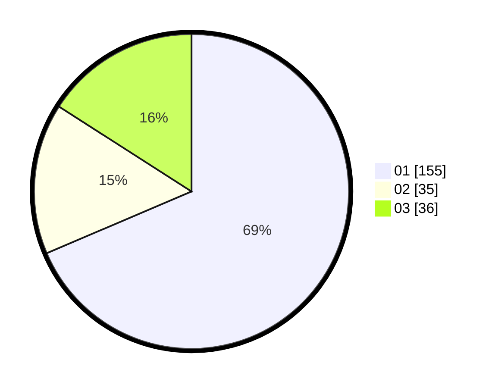

# Hasil

Hasil perolehan suara paslon dapat dilihat pada file paslon-01.txt, paslon-02.txt, dan paslon-03.txt.

Jika tidak ada, artinya data tersebut belum ada pada SIREKAP.

## Perolehan Suara

 * Paslon 01: **155**.
 * Paslon 02: **35**.
 * Paslon 03: **36**.

## Foto C Plano

https://sirekap-obj-formc.kpu.go.id/b7c2/pemilu/ppwp/31/74/01/10/01/3174011001017-20240214-200653--56de00cd-8d22-49e8-b352-f2e12b1deb70.jpg

https://sirekap-obj-formc.kpu.go.id/b7c2/pemilu/ppwp/31/74/01/10/01/3174011001017-20240214-192611--3d20dfc2-8ab0-45fd-a767-6cb49d963a27.jpg

https://sirekap-obj-formc.kpu.go.id/b7c2/pemilu/ppwp/31/74/01/10/01/3174011001017-20240214-192635--00194f2e-9a7a-489b-bc77-e571515d341b.jpg
