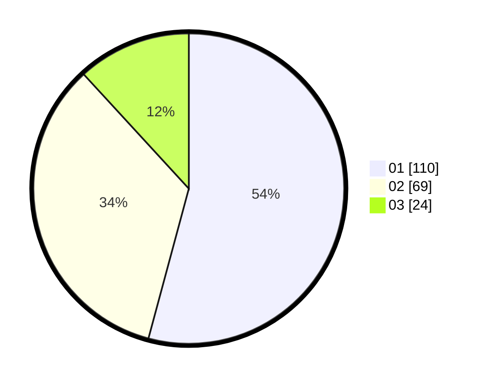

# Hasil

Hasil perolehan suara paslon dapat dilihat pada file paslon-01.txt, paslon-02.txt, dan paslon-03.txt.

Jika tidak ada, artinya data tersebut belum ada pada SIREKAP.

## Perolehan Suara

 * Paslon 01: **110**.
 * Paslon 02: **69**.
 * Paslon 03: **24**.

## Foto C Plano

https://sirekap-obj-formc.kpu.go.id/9d98/pemilu/ppwp/31/74/01/10/01/3174011001019-20240216-131539--281e9abe-3e75-403f-8922-533e9194f40b.jpg

https://sirekap-obj-formc.kpu.go.id/9d98/pemilu/ppwp/31/74/01/10/01/3174011001019-20240216-131540--8a35026b-980b-4f0f-acce-294bd1c400fb.jpg

https://sirekap-obj-formc.kpu.go.id/9d98/pemilu/ppwp/31/74/01/10/01/3174011001019-20240216-131540--9ba0f81f-a983-4fd2-bed0-a124439091aa.jpg

## DATA PEMILIH TETAP

Jumlah pemilih dalam DPT: **245**.
 * L: **119**.
 * P: **126**.

## DATA PENGGUNA HAK PILIH

Jumlah pengguna hak pilih dalam DPT: **197**.
 * L: **98**.
 * P: **99**.

Jumlah pengguna hak pilih dalam DPTb: **8**.
 * L: **1**.
 * P: **7**.

Jumlah pengguna hak pilih dalam DPK: **0**.
 * L: **0**.
 * P: **0**.

Jumlah pengguna hak pilih: **205**.
 * L: **99**.
 * P: **106**.

## JUMLAH SUARA SAH DAN TIDAK SAH

JUMLAH SELURUH SUARA SAH: **203**.

JUMLAH SUARA TIDAK SAH: **2**.

JUMLAH SELURUH SUARA SAH DAN SUARA TIDAK SAH: **205**.
