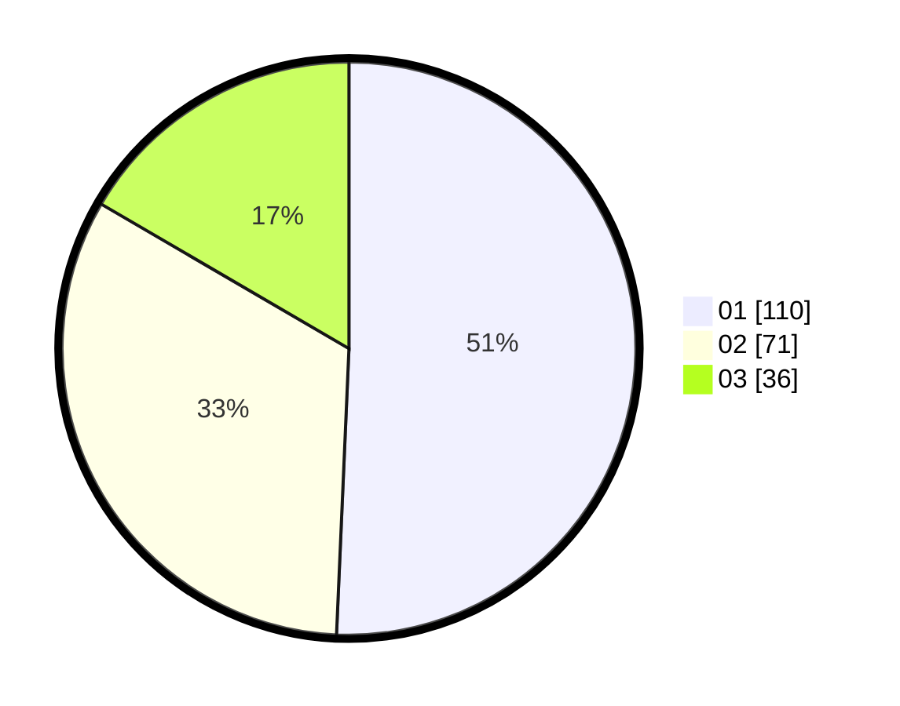

# Hasil

Hasil perolehan suara paslon dapat dilihat pada file paslon-01.txt, paslon-02.txt, dan paslon-03.txt.

Jika tidak ada, artinya data tersebut belum ada pada SIREKAP.

## Perolehan Suara

 * Paslon 01: **110**.
 * Paslon 02: **71**.
 * Paslon 03: **36**.

## Foto C Plano

https://sirekap-obj-formc.kpu.go.id/ef03/pemilu/ppwp/31/74/01/10/01/3174011001023-20240214-210151--cc55b24c-7a9a-441d-a2e3-51411c150a7b.jpg

https://sirekap-obj-formc.kpu.go.id/ef03/pemilu/ppwp/31/74/01/10/01/3174011001023-20240214-205950--a80a004d-62f3-45ab-9ec8-fcd552a98fe9.jpg

https://sirekap-obj-formc.kpu.go.id/ef03/pemilu/ppwp/31/74/01/10/01/3174011001023-20240214-205820--6175130e-7155-4c47-8802-8fbec9ef18f8.jpg

## DATA PEMILIH TETAP

Jumlah pemilih dalam DPT: **245**.
 * L: **116**.
 * P: **129**.

## DATA PENGGUNA HAK PILIH

Jumlah pengguna hak pilih dalam DPT: **207**.
 * L: **93**.
 * P: **224**.

Jumlah pengguna hak pilih dalam DPTb: **22**.
 * L: **4**.
 * P: **7**.

Jumlah pengguna hak pilih dalam DPK: **2**.
 * L: **2**.
 * P: **0**.

Jumlah pengguna hak pilih: **220**.
 * L: **99**.
 * P: **121**.

## JUMLAH SUARA SAH DAN TIDAK SAH

JUMLAH SELURUH SUARA SAH: **217**.

JUMLAH SUARA TIDAK SAH: **3**.

JUMLAH SELURUH SUARA SAH DAN SUARA TIDAK SAH: **220**.
