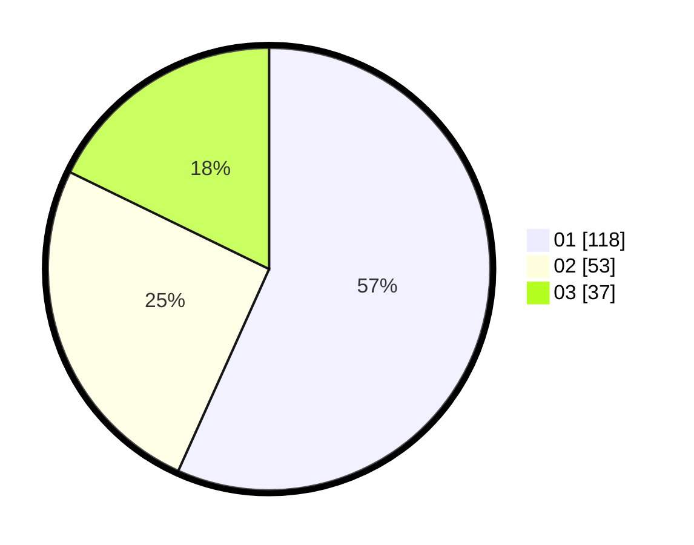

# Hasil

Hasil perolehan suara paslon dapat dilihat pada file paslon-01.txt, paslon-02.txt, dan paslon-03.txt.

Jika tidak ada, artinya data tersebut belum ada pada SIREKAP.

## Perolehan Suara

 * Paslon 01: **118**.
 * Paslon 02: **53**.
 * Paslon 03: **37**.

## Foto C Plano

https://sirekap-obj-formc.kpu.go.id/f6aa/pemilu/ppwp/31/74/01/10/01/3174011001025-20240214-204943--b3d4c636-f5ac-4d24-89f7-d0c7ff4e26f0.jpg

https://sirekap-obj-formc.kpu.go.id/f6aa/pemilu/ppwp/31/74/01/10/01/3174011001025-20240214-205204--912d4375-ab7e-4633-938d-bcb0e00396a8.jpg

https://sirekap-obj-formc.kpu.go.id/f6aa/pemilu/ppwp/31/74/01/10/01/3174011001025-20240214-205252--7835a46f-bf41-4790-b766-63a6c59d7b37.jpg

## DATA PEMILIH TETAP

Jumlah pemilih dalam DPT: **271**.
 * L: **124**.
 * P: **147**.

## DATA PENGGUNA HAK PILIH

Jumlah pengguna hak pilih dalam DPT: **201**.
 * L: **90**.
 * P: **111**.

Jumlah pengguna hak pilih dalam DPTb: **9**.
 * L: **2**.
 * P: **7**.

Jumlah pengguna hak pilih dalam DPK: **0**.
 * L: **0**.
 * P: **0**.

Jumlah pengguna hak pilih: **210**.
 * L: **92**.
 * P: **118**.

## JUMLAH SUARA SAH DAN TIDAK SAH

JUMLAH SELURUH SUARA SAH: **208**.

JUMLAH SUARA TIDAK SAH: **2**.

JUMLAH SELURUH SUARA SAH DAN SUARA TIDAK SAH: **210**.
