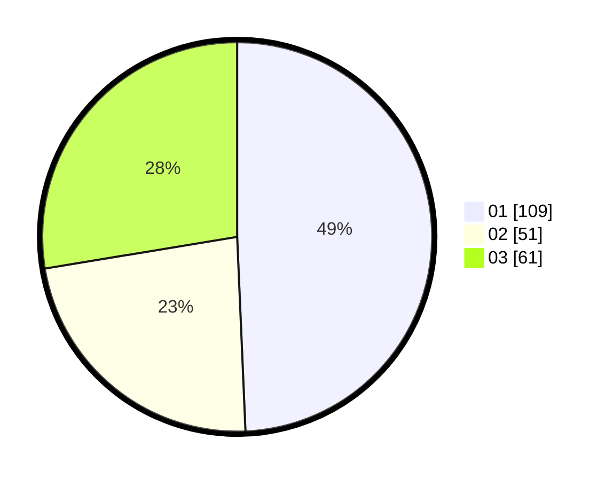

# Hasil

Hasil perolehan suara paslon dapat dilihat pada file paslon-01.txt, paslon-02.txt, dan paslon-03.txt.

Jika tidak ada, artinya data tersebut belum ada pada SIREKAP.

## Perolehan Suara

 * Paslon 01: **109**.
 * Paslon 02: **51**.
 * Paslon 03: **61**.

## Foto C Plano

https://sirekap-obj-formc.kpu.go.id/31c2/pemilu/ppwp/31/74/01/10/01/3174011001027-20240214-202233--0de77d00-6889-4ddc-8118-7c14f05019a6.jpg

https://sirekap-obj-formc.kpu.go.id/31c2/pemilu/ppwp/31/74/01/10/01/3174011001027-20240214-202350--17c0e8f4-d4d2-47a8-a472-2e782734886b.jpg

https://sirekap-obj-formc.kpu.go.id/31c2/pemilu/ppwp/31/74/01/10/01/3174011001027-20240214-202445--6e55745e-35ed-4ee0-b9b3-23067303f30f.jpg

## DATA PEMILIH TETAP

Jumlah pemilih dalam DPT: **222**.
 * L: **101**.
 * P: **121**.

## DATA PENGGUNA HAK PILIH

Jumlah pengguna hak pilih dalam DPT: **197**.
 * L: **90**.
 * P: **107**.

Jumlah pengguna hak pilih dalam DPTb: **23**.
 * L: **10**.
 * P: **13**.

Jumlah pengguna hak pilih dalam DPK: **2**.
 * L: **1**.
 * P: **1**.

Jumlah pengguna hak pilih: **222**.
 * L: **101**.
 * P: **121**.

## JUMLAH SUARA SAH DAN TIDAK SAH

JUMLAH SELURUH SUARA SAH: **221**.

JUMLAH SUARA TIDAK SAH: **1**.

JUMLAH SELURUH SUARA SAH DAN SUARA TIDAK SAH: **222**.
