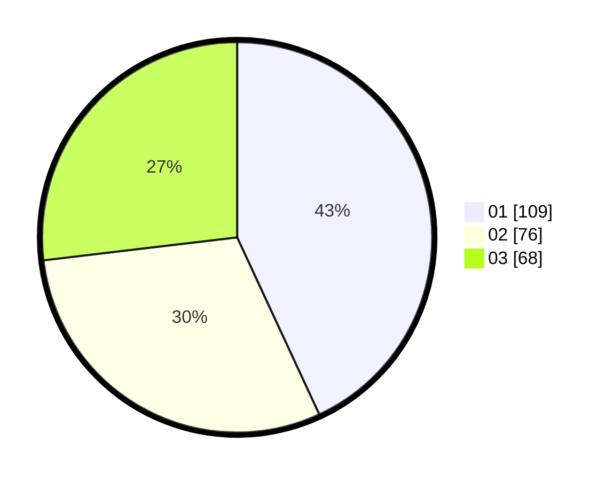

# Hasil

Hasil perolehan suara paslon dapat dilihat pada file paslon-01.txt, paslon-02.txt, dan paslon-03.txt.

Jika tidak ada, artinya data tersebut belum ada pada SIREKAP.

## Perolehan Suara

 * Paslon 01: **109**.
 * Paslon 02: **76**.
 * Paslon 03: **68**.

## Foto C Plano

https://sirekap-obj-formc.kpu.go.id/70bd/pemilu/ppwp/31/74/01/10/01/3174011001029-20240215-010020--ed219349-2602-47b5-8a68-3f65db50afd1.jpg

https://sirekap-obj-formc.kpu.go.id/70bd/pemilu/ppwp/31/74/01/10/01/3174011001029-20240215-005840--0d1f7fc1-aa5f-47ce-ab0a-a98d0318a050.jpg

https://sirekap-obj-formc.kpu.go.id/70bd/pemilu/ppwp/31/74/01/10/01/3174011001029-20240215-005923--2f6c7212-20d7-49e3-8624-eec40320a1dc.jpg

## DATA PEMILIH TETAP

Jumlah pemilih dalam DPT: **264**.
 * L: **122**.
 * P: **142**.

## DATA PENGGUNA HAK PILIH

Jumlah pengguna hak pilih dalam DPT: **230**.
 * L: **106**.
 * P: **124**.

Jumlah pengguna hak pilih dalam DPTb: **7**.
 * L: **2**.
 * P: **5**.

Jumlah pengguna hak pilih dalam DPK: **20**.
 * L: **11**.
 * P: **9**.

Jumlah pengguna hak pilih: **257**.
 * L: **119**.
 * P: **138**.

## JUMLAH SUARA SAH DAN TIDAK SAH

JUMLAH SELURUH SUARA SAH: **253**.

JUMLAH SUARA TIDAK SAH: **4**.

JUMLAH SELURUH SUARA SAH DAN SUARA TIDAK SAH: **257**.
