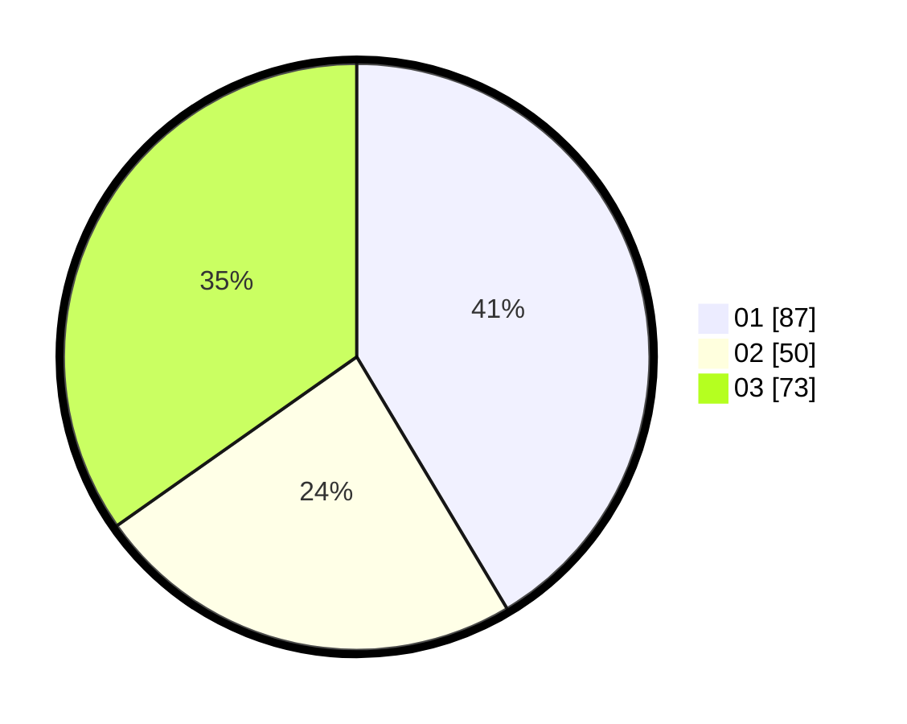

# Hasil

Hasil perolehan suara paslon dapat dilihat pada file paslon-01.txt, paslon-02.txt, dan paslon-03.txt.

Jika tidak ada, artinya data tersebut belum ada pada SIREKAP.

## Perolehan Suara

 * Paslon 01: **87**.
 * Paslon 02: **50**.
 * Paslon 03: **73**.

## Foto C Plano

https://sirekap-obj-formc.kpu.go.id/96b2/pemilu/ppwp/31/74/01/10/01/3174011001039-20240214-185722--547517cb-2243-4899-8b4c-2d4ae2b09b5f.jpg

https://sirekap-obj-formc.kpu.go.id/96b2/pemilu/ppwp/31/74/01/10/01/3174011001039-20240214-190326--a8ced5a1-5869-425e-884b-2560f4472426.jpg

https://sirekap-obj-formc.kpu.go.id/96b2/pemilu/ppwp/31/74/01/10/01/3174011001039-20240214-185956--0a8a0e29-2056-49d9-86cf-f02a3df296bb.jpg

## DATA PEMILIH TETAP

Jumlah pemilih dalam DPT: **241**.
 * L: **108**.
 * P: **133**.

## DATA PENGGUNA HAK PILIH

Jumlah pengguna hak pilih dalam DPT: **200**.
 * L: **84**.
 * P: **116**.

Jumlah pengguna hak pilih dalam DPTb: **13**.
 * L: **5**.
 * P: **8**.

Jumlah pengguna hak pilih dalam DPK: **1**.
 * L: **1**.
 * P: **0**.

Jumlah pengguna hak pilih: **214**.
 * L: **90**.
 * P: **124**.

## JUMLAH SUARA SAH DAN TIDAK SAH

JUMLAH SELURUH SUARA SAH: **210**.

JUMLAH SUARA TIDAK SAH: **4**.

JUMLAH SELURUH SUARA SAH DAN SUARA TIDAK SAH: **214**.
