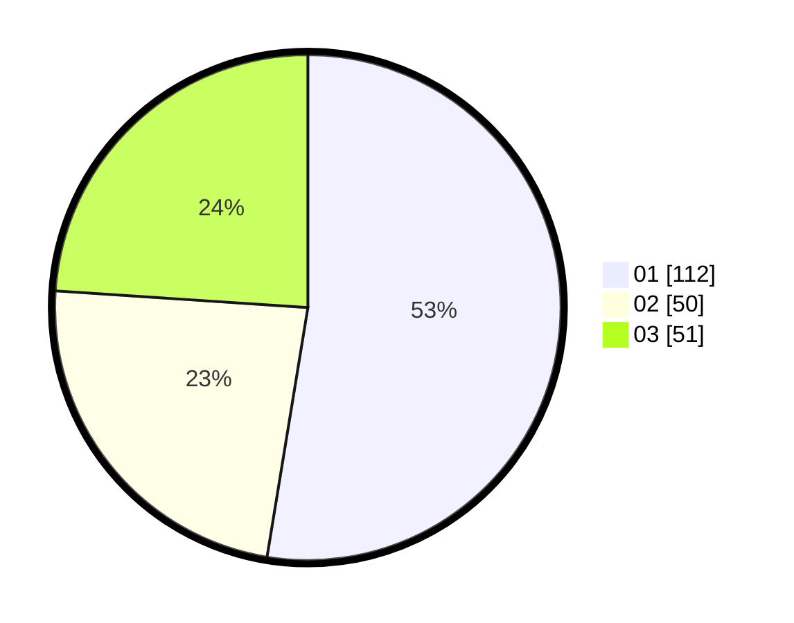

# Hasil

Hasil perolehan suara paslon dapat dilihat pada file paslon-01.txt, paslon-02.txt, dan paslon-03.txt.

Jika tidak ada, artinya data tersebut belum ada pada SIREKAP.

## Perolehan Suara

 * Paslon 01: **112**.
 * Paslon 02: **50**.
 * Paslon 03: **51**.

## Foto C Plano

https://sirekap-obj-formc.kpu.go.id/9356/pemilu/ppwp/31/74/01/10/01/3174011001041-20240214-155057--f8ef466b-2229-45c9-a790-b7f2218ae2eb.jpg

https://sirekap-obj-formc.kpu.go.id/9356/pemilu/ppwp/31/74/01/10/01/3174011001041-20240214-155028--d33b4edf-044b-43d1-a64a-8cc7a6a4d561.jpg

https://sirekap-obj-formc.kpu.go.id/9356/pemilu/ppwp/31/74/01/10/01/3174011001041-20240214-155143--67171ee1-433c-4ef2-92bf-1785c8c0d7a5.jpg

## DATA PEMILIH TETAP

Jumlah pemilih dalam DPT: **262**.
 * L: **119**.
 * P: **143**.

## DATA PENGGUNA HAK PILIH

Jumlah pengguna hak pilih dalam DPT: **212**.
 * L: **99**.
 * P: **113**.

Jumlah pengguna hak pilih dalam DPTb: **3**.
 * L: **0**.
 * P: **3**.

Jumlah pengguna hak pilih dalam DPK: **1**.
 * L: **1**.
 * P: **0**.

Jumlah pengguna hak pilih: **216**.
 * L: **100**.
 * P: **116**.

## JUMLAH SUARA SAH DAN TIDAK SAH

JUMLAH SELURUH SUARA SAH: **213**.

JUMLAH SUARA TIDAK SAH: **3**.

JUMLAH SELURUH SUARA SAH DAN SUARA TIDAK SAH: **216**.
