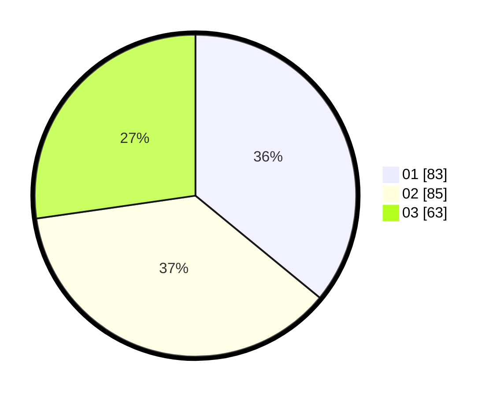

# Hasil

Hasil perolehan suara paslon dapat dilihat pada file paslon-01.txt, paslon-02.txt, dan paslon-03.txt.

Jika tidak ada, artinya data tersebut belum ada pada SIREKAP.

## Perolehan Suara

 * Paslon 01: **83**.
 * Paslon 02: **85**.
 * Paslon 03: **63**.

## Foto C Plano

https://sirekap-obj-formc.kpu.go.id/a7a8/pemilu/ppwp/31/74/01/10/01/3174011001044-20240214-155741--11f30e6d-74c9-4a4b-8cf0-5ec50afcfaf4.jpg

https://sirekap-obj-formc.kpu.go.id/a7a8/pemilu/ppwp/31/74/01/10/01/3174011001044-20240214-155915--a31391ba-8540-42a2-9243-74d6f8ecb507.jpg

https://sirekap-obj-formc.kpu.go.id/a7a8/pemilu/ppwp/31/74/01/10/01/3174011001044-20240214-160110--5b3a8a3a-03a0-4e4e-ab18-078d2bde6ab6.jpg

## DATA PEMILIH TETAP

Jumlah pemilih dalam DPT: **225**.
 * L: **108**.
 * P: **117**.

## DATA PENGGUNA HAK PILIH

Jumlah pengguna hak pilih dalam DPT: **225**.
 * L: **108**.
 * P: **117**.

Jumlah pengguna hak pilih dalam DPTb: **7**.
 * L: **2**.
 * P: **5**.

Jumlah pengguna hak pilih dalam DPK: **1**.
 * L: **1**.
 * P: **0**.

Jumlah pengguna hak pilih: **233**.
 * L: **111**.
 * P: **122**.

## JUMLAH SUARA SAH DAN TIDAK SAH

JUMLAH SELURUH SUARA SAH: **231**.

JUMLAH SUARA TIDAK SAH: **2**.

JUMLAH SELURUH SUARA SAH DAN SUARA TIDAK SAH: **233**.
