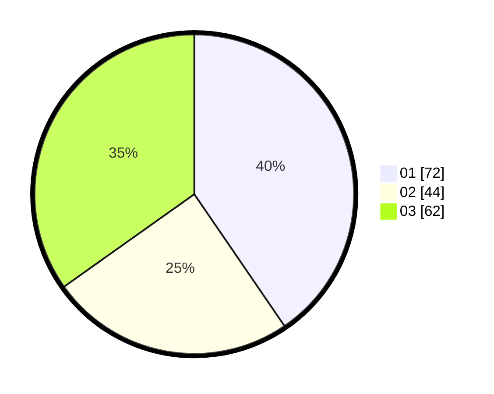

# Hasil

Hasil perolehan suara paslon dapat dilihat pada file paslon-01.txt, paslon-02.txt, dan paslon-03.txt.

Jika tidak ada, artinya data tersebut belum ada pada SIREKAP.

## Perolehan Suara

 * Paslon 01: **72**.
 * Paslon 02: **44**.
 * Paslon 03: **62**.

## Foto C Plano

https://sirekap-obj-formc.kpu.go.id/6edb/pemilu/ppwp/31/74/01/10/01/3174011001050-20240214-212552--93998bcf-537a-455b-80bd-d6f5c2a9d874.jpg

https://sirekap-obj-formc.kpu.go.id/6edb/pemilu/ppwp/31/74/01/10/01/3174011001050-20240214-212720--a901a228-9291-410b-b277-e8059c3bb6e5.jpg

https://sirekap-obj-formc.kpu.go.id/6edb/pemilu/ppwp/31/74/01/10/01/3174011001050-20240214-212836--e0e3be70-583c-44b4-8078-06c0f42cc3f5.jpg

## DATA PEMILIH TETAP

Jumlah pemilih dalam DPT: **204**.
 * L: **90**.
 * P: **114**.

## DATA PENGGUNA HAK PILIH

Jumlah pengguna hak pilih dalam DPT: **163**.
 * L: **70**.
 * P: **93**.

Jumlah pengguna hak pilih dalam DPTb: **16**.
 * L: **5**.
 * P: **11**.

Jumlah pengguna hak pilih dalam DPK: **1**.
 * L: **0**.
 * P: **1**.

Jumlah pengguna hak pilih: **180**.
 * L: **75**.
 * P: **105**.

## JUMLAH SUARA SAH DAN TIDAK SAH

JUMLAH SELURUH SUARA SAH: **178**.

JUMLAH SUARA TIDAK SAH: **2**.

JUMLAH SELURUH SUARA SAH DAN SUARA TIDAK SAH: **180**.
