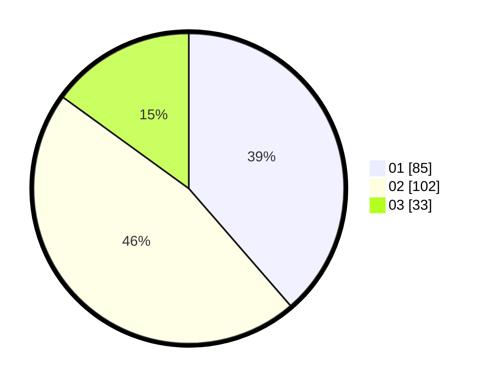

# Hasil

Hasil perolehan suara paslon dapat dilihat pada file paslon-01.txt, paslon-02.txt, dan paslon-03.txt.

Jika tidak ada, artinya data tersebut belum ada pada SIREKAP.

## Perolehan Suara

 * Paslon 01: **85**.
 * Paslon 02: **102**.
 * Paslon 03: **33**.

## Foto C Plano

https://sirekap-obj-formc.kpu.go.id/5b8a/pemilu/ppwp/31/74/01/10/01/3174011001055-20240214-191247--c73cbe96-a534-4c5e-b37a-60301585ce89.jpg

https://sirekap-obj-formc.kpu.go.id/5b8a/pemilu/ppwp/31/74/01/10/01/3174011001055-20240214-201314--7319bb4d-24d0-4631-946a-c3a772a92011.jpg

https://sirekap-obj-formc.kpu.go.id/5b8a/pemilu/ppwp/31/74/01/10/01/3174011001055-20240214-192057--ff512e80-1553-452f-9054-5eca7aaa0273.jpg

## DATA PEMILIH TETAP

Jumlah pemilih dalam DPT: **261**.
 * L: **130**.
 * P: **131**.

## DATA PENGGUNA HAK PILIH

Jumlah pengguna hak pilih dalam DPT: **217**.
 * L: **103**.
 * P: **114**.

Jumlah pengguna hak pilih dalam DPTb: **5**.
 * L: **1**.
 * P: **4**.

Jumlah pengguna hak pilih dalam DPK: **1**.
 * L: **1**.
 * P: **0**.

Jumlah pengguna hak pilih: **223**.
 * L: **105**.
 * P: **118**.

## JUMLAH SUARA SAH DAN TIDAK SAH

JUMLAH SELURUH SUARA SAH: **220**.

JUMLAH SUARA TIDAK SAH: **3**.

JUMLAH SELURUH SUARA SAH DAN SUARA TIDAK SAH: **223**.
