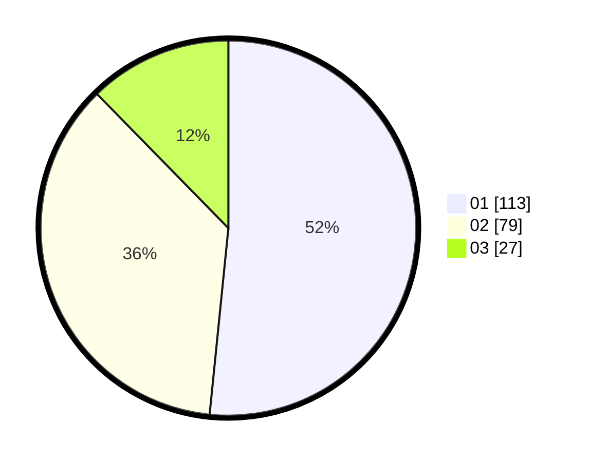

# Hasil

Hasil perolehan suara paslon dapat dilihat pada file paslon-01.txt, paslon-02.txt, dan paslon-03.txt.

Jika tidak ada, artinya data tersebut belum ada pada SIREKAP.

## Perolehan Suara

 * Paslon 01: **113**.
 * Paslon 02: **79**.
 * Paslon 03: **27**.

## Foto C Plano

https://sirekap-obj-formc.kpu.go.id/212c/pemilu/ppwp/31/74/01/10/01/3174011001057-20240216-164440--16082d43-63fa-42f4-bce3-5286c40ed7b8.jpg

https://sirekap-obj-formc.kpu.go.id/212c/pemilu/ppwp/31/74/01/10/01/3174011001057-20240216-191236--81f7a2d3-6584-4d54-9ba3-8604141b7711.jpg

https://sirekap-obj-formc.kpu.go.id/212c/pemilu/ppwp/31/74/01/10/01/3174011001057-20240215-004844--5cc8cb14-e2bd-4348-ad30-09b1f5ca0a79.jpg

## DATA PEMILIH TETAP

Jumlah pemilih dalam DPT: **268**.
 * L: **132**.
 * P: **136**.

## DATA PENGGUNA HAK PILIH

Jumlah pengguna hak pilih dalam DPT: **210**.
 * L: **101**.
 * P: **109**.

Jumlah pengguna hak pilih dalam DPTb: **7**.
 * L: **3**.
 * P: **4**.

Jumlah pengguna hak pilih dalam DPK: **4**.
 * L: **1**.
 * P: **3**.

Jumlah pengguna hak pilih: **221**.
 * L: **105**.
 * P: **116**.

## JUMLAH SUARA SAH DAN TIDAK SAH

JUMLAH SELURUH SUARA SAH: **219**.

JUMLAH SUARA TIDAK SAH: **2**.

JUMLAH SELURUH SUARA SAH DAN SUARA TIDAK SAH: **221**.
