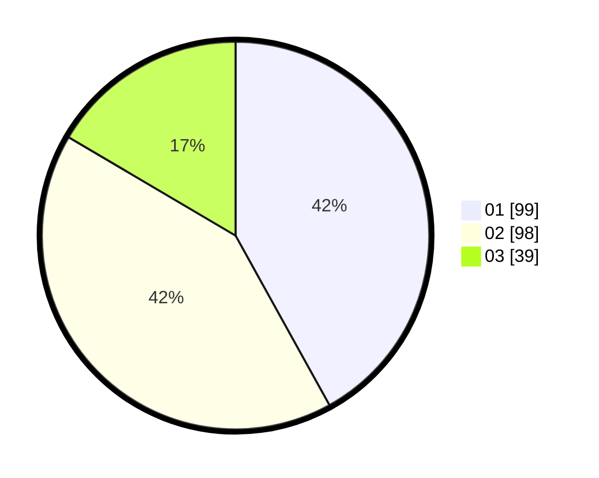

# Hasil

Hasil perolehan suara paslon dapat dilihat pada file paslon-01.txt, paslon-02.txt, dan paslon-03.txt.

Jika tidak ada, artinya data tersebut belum ada pada SIREKAP.

## Perolehan Suara

 * Paslon 01: **99**.
 * Paslon 02: **98**.
 * Paslon 03: **39**.

## Foto C Plano

https://sirekap-obj-formc.kpu.go.id/4dae/pemilu/ppwp/31/74/01/10/02/3174011002014-20240214-192328--f0f390f9-8c40-4c78-8202-b345c0b6591a.jpg

https://sirekap-obj-formc.kpu.go.id/4dae/pemilu/ppwp/31/74/01/10/02/3174011002014-20240214-194703--d129a6e4-2715-429f-982f-1c2936a81580.jpg

https://sirekap-obj-formc.kpu.go.id/4dae/pemilu/ppwp/31/74/01/10/02/3174011002014-20240214-194812--099291bd-ea59-4e24-b2ba-4ecfa18e8ecb.jpg

## DATA PEMILIH TETAP

Jumlah pemilih dalam DPT: **225**.
 * L: **114**.
 * P: **111**.

## DATA PENGGUNA HAK PILIH

Jumlah pengguna hak pilih dalam DPT: **225**.
 * L: **114**.
 * P: **111**.

Jumlah pengguna hak pilih dalam DPTb: **3**.
 * L: **2**.
 * P: **1**.

Jumlah pengguna hak pilih dalam DPK: **10**.
 * L: **5**.
 * P: **5**.

Jumlah pengguna hak pilih: **238**.
 * L: **121**.
 * P: **117**.

## JUMLAH SUARA SAH DAN TIDAK SAH

JUMLAH SELURUH SUARA SAH: **236**.

JUMLAH SUARA TIDAK SAH: **2**.

JUMLAH SELURUH SUARA SAH DAN SUARA TIDAK SAH: **238**.
