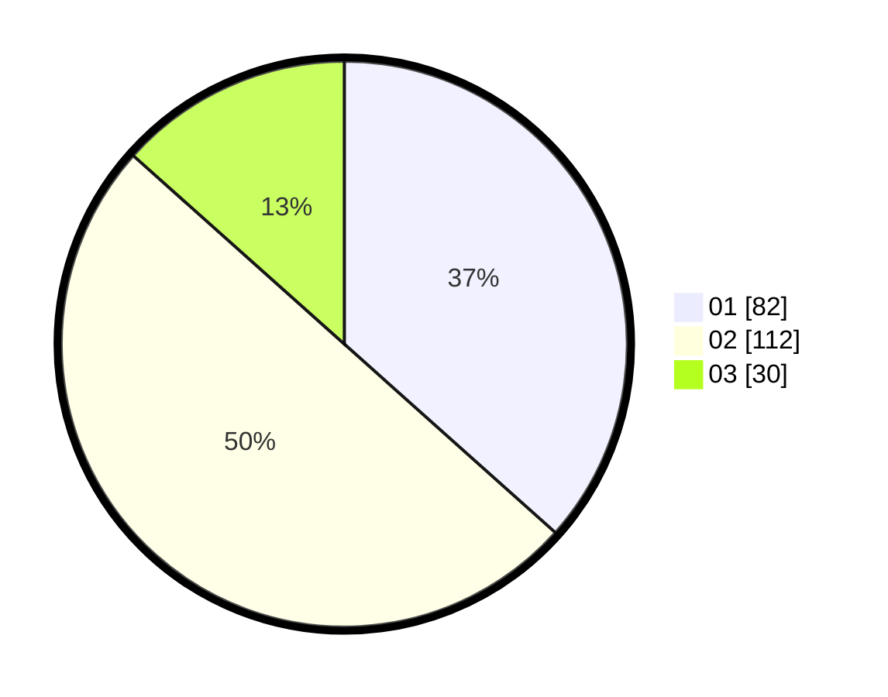

# Hasil

Hasil perolehan suara paslon dapat dilihat pada file paslon-01.txt, paslon-02.txt, dan paslon-03.txt.

Jika tidak ada, artinya data tersebut belum ada pada SIREKAP.

## Perolehan Suara

 * Paslon 01: **82**.
 * Paslon 02: **112**.
 * Paslon 03: **30**.

## Foto C Plano

https://sirekap-obj-formc.kpu.go.id/bba4/pemilu/ppwp/31/74/01/10/02/3174011002016-20240214-184937--9ab2b6ce-2c3f-43a5-aecb-df62318ec877.jpg

https://sirekap-obj-formc.kpu.go.id/bba4/pemilu/ppwp/31/74/01/10/02/3174011002016-20240214-184844--3322caea-c75a-4feb-99d1-26c693c7a43e.jpg

https://sirekap-obj-formc.kpu.go.id/bba4/pemilu/ppwp/31/74/01/10/02/3174011002016-20240214-160055--99fccabd-5ae2-4f5a-bd07-9b1e580eeff8.jpg

## DATA PEMILIH TETAP

Jumlah pemilih dalam DPT: **271**.
 * L: **124**.
 * P: **147**.

## DATA PENGGUNA HAK PILIH

Jumlah pengguna hak pilih dalam DPT: **229**.
 * L: **104**.
 * P: **125**.

Jumlah pengguna hak pilih dalam DPTb: **2**.
 * L: **2**.
 * P: **0**.

Jumlah pengguna hak pilih dalam DPK: **1**.
 * L: **0**.
 * P: **1**.

Jumlah pengguna hak pilih: **232**.
 * L: **106**.
 * P: **126**.

## JUMLAH SUARA SAH DAN TIDAK SAH

JUMLAH SELURUH SUARA SAH: **224**.

JUMLAH SUARA TIDAK SAH: **8**.

JUMLAH SELURUH SUARA SAH DAN SUARA TIDAK SAH: **232**.
