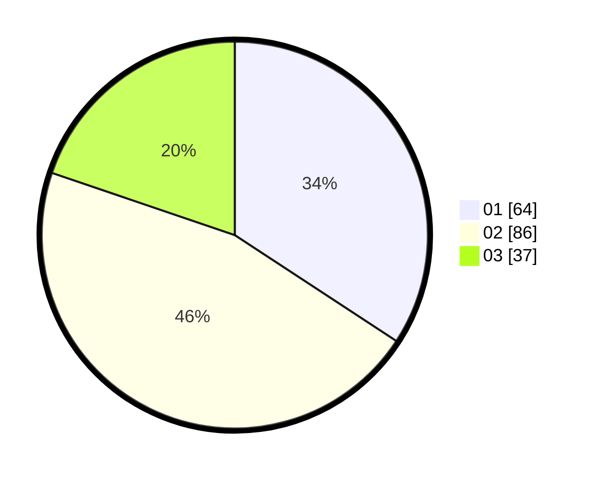

# Hasil

Hasil perolehan suara paslon dapat dilihat pada file paslon-01.txt, paslon-02.txt, dan paslon-03.txt.

Jika tidak ada, artinya data tersebut belum ada pada SIREKAP.

## Perolehan Suara

 * Paslon 01: **64**.
 * Paslon 02: **86**.
 * Paslon 03: **37**.

## Foto C Plano

https://sirekap-obj-formc.kpu.go.id/648f/pemilu/ppwp/31/74/01/10/02/3174011002032-20240214-234616--298cff0b-346c-4d6e-ab9a-643c4d2ed0e0.jpg

https://sirekap-obj-formc.kpu.go.id/648f/pemilu/ppwp/31/74/01/10/02/3174011002032-20240214-234734--84b243a6-9355-4480-8f21-24038a6df2af.jpg

https://sirekap-obj-formc.kpu.go.id/648f/pemilu/ppwp/31/74/01/10/02/3174011002032-20240214-235117--678bbf98-a01c-41e0-a9b9-0a05adebe05a.jpg
