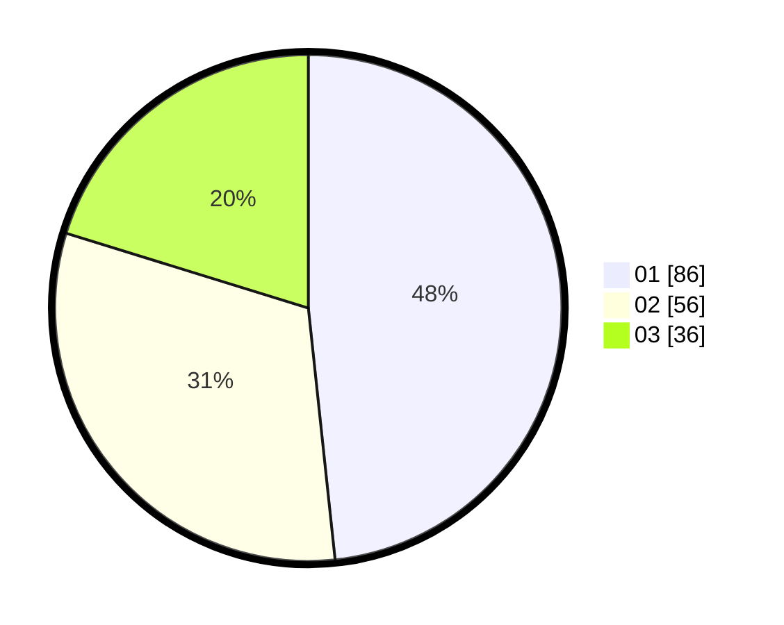

# Hasil

Hasil perolehan suara paslon dapat dilihat pada file paslon-01.txt, paslon-02.txt, dan paslon-03.txt.

Jika tidak ada, artinya data tersebut belum ada pada SIREKAP.

## Perolehan Suara

 * Paslon 01: **86**.
 * Paslon 02: **56**.
 * Paslon 03: **36**.

## Foto C Plano

https://sirekap-obj-formc.kpu.go.id/b372/pemilu/ppwp/31/74/01/10/02/3174011002034-20240214-203601--55c6d380-b01e-4986-b690-841d363d764b.jpg

https://sirekap-obj-formc.kpu.go.id/b372/pemilu/ppwp/31/74/01/10/02/3174011002034-20240214-204921--3b40cbaa-0a53-4f62-ab0e-79336fe38350.jpg

https://sirekap-obj-formc.kpu.go.id/b372/pemilu/ppwp/31/74/01/10/02/3174011002034-20240214-203725--af9d2009-9410-4b4f-9b20-bb4b76be379f.jpg

## DATA PEMILIH TETAP

Jumlah pemilih dalam DPT: **203**.
 * L: **92**.
 * P: **111**.

## DATA PENGGUNA HAK PILIH

Jumlah pengguna hak pilih dalam DPT: **170**.
 * L: **73**.
 * P: **97**.

Jumlah pengguna hak pilih dalam DPTb: **9**.
 * L: **1**.
 * P: **8**.

Jumlah pengguna hak pilih dalam DPK: **0**.
 * L: **0**.
 * P: **0**.

Jumlah pengguna hak pilih: **179**.
 * L: **74**.
 * P: **105**.

## JUMLAH SUARA SAH DAN TIDAK SAH

JUMLAH SELURUH SUARA SAH: **178**.

JUMLAH SUARA TIDAK SAH: **1**.

JUMLAH SELURUH SUARA SAH DAN SUARA TIDAK SAH: **179**.
