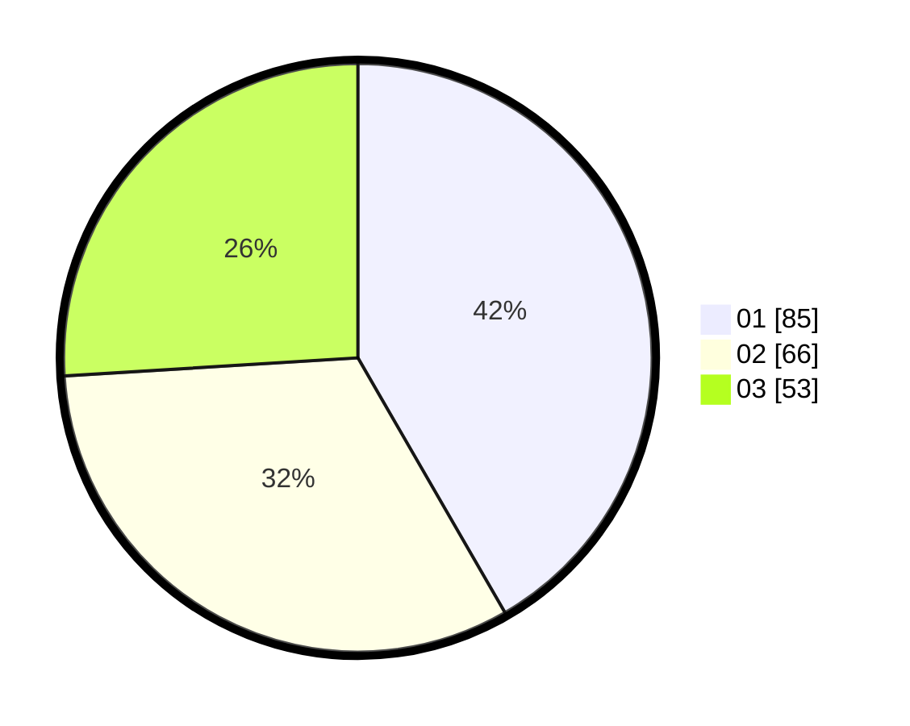

# Hasil

Hasil perolehan suara paslon dapat dilihat pada file paslon-01.txt, paslon-02.txt, dan paslon-03.txt.

Jika tidak ada, artinya data tersebut belum ada pada SIREKAP.

## Perolehan Suara

 * Paslon 01: **85**.
 * Paslon 02: **66**.
 * Paslon 03: **53**.

## Foto C Plano

https://sirekap-obj-formc.kpu.go.id/98e2/pemilu/ppwp/31/74/01/10/02/3174011002037-20240214-195139--727425ef-fa71-4734-a734-53b597dc91e6.jpg

https://sirekap-obj-formc.kpu.go.id/98e2/pemilu/ppwp/31/74/01/10/02/3174011002037-20240214-204847--5ea9362c-bd10-4083-86c9-9a785f22cd03.jpg

https://sirekap-obj-formc.kpu.go.id/98e2/pemilu/ppwp/31/74/01/10/02/3174011002037-20240214-204952--23fd7078-05bf-4944-bb59-ec297c0cb05b.jpg

## DATA PEMILIH TETAP

Jumlah pemilih dalam DPT: **238**.
 * L: **117**.
 * P: **121**.

## DATA PENGGUNA HAK PILIH

Jumlah pengguna hak pilih dalam DPT: **192**.
 * L: **96**.
 * P: **101**.

Jumlah pengguna hak pilih dalam DPTb: **11**.
 * L: **5**.
 * P: **6**.

Jumlah pengguna hak pilih dalam DPK: **4**.
 * L: **3**.
 * P: **1**.

Jumlah pengguna hak pilih: **207**.
 * L: **99**.
 * P: **108**.

## JUMLAH SUARA SAH DAN TIDAK SAH

JUMLAH SELURUH SUARA SAH: **204**.

JUMLAH SUARA TIDAK SAH: **3**.

JUMLAH SELURUH SUARA SAH DAN SUARA TIDAK SAH: **207**.
