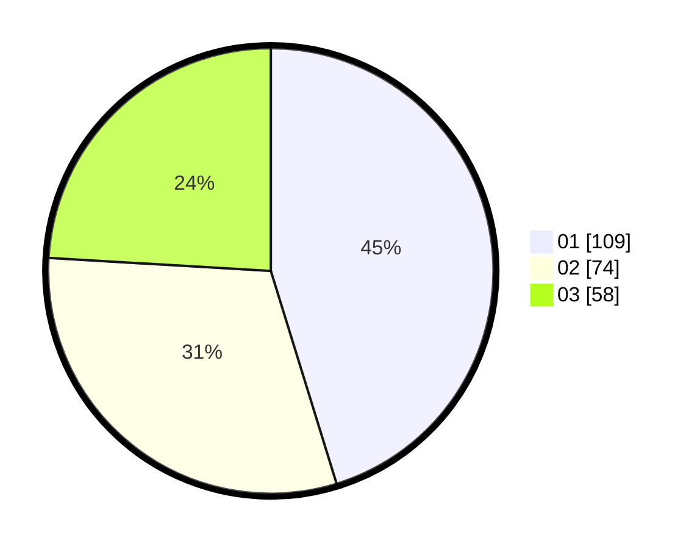

# Hasil

Hasil perolehan suara paslon dapat dilihat pada file paslon-01.txt, paslon-02.txt, dan paslon-03.txt.

Jika tidak ada, artinya data tersebut belum ada pada SIREKAP.

## Perolehan Suara

 * Paslon 01: **109**.
 * Paslon 02: **74**.
 * Paslon 03: **58**.

## Foto C Plano

https://sirekap-obj-formc.kpu.go.id/07f5/pemilu/ppwp/31/74/01/10/02/3174011002038-20240214-212222--5576aeac-4d3e-4ef1-ae6a-9a856ffba425.jpg

https://sirekap-obj-formc.kpu.go.id/07f5/pemilu/ppwp/31/74/01/10/02/3174011002038-20240214-212251--4d2bb134-5fc8-4097-a733-c1c5278f82ac.jpg

https://sirekap-obj-formc.kpu.go.id/07f5/pemilu/ppwp/31/74/01/10/02/3174011002038-20240214-212308--edbd00c0-7150-4334-a6ac-e626b4734c36.jpg

## DATA PEMILIH TETAP

Jumlah pemilih dalam DPT: **273**.
 * L: **132**.
 * P: **141**.

## DATA PENGGUNA HAK PILIH

Jumlah pengguna hak pilih dalam DPT: **220**.
 * L: **108**.
 * P: **112**.

Jumlah pengguna hak pilih dalam DPTb: **20**.
 * L: **10**.
 * P: **10**.

Jumlah pengguna hak pilih dalam DPK: **4**.
 * L: **2**.
 * P: **2**.

Jumlah pengguna hak pilih: **244**.
 * L: **120**.
 * P: **124**.

## JUMLAH SUARA SAH DAN TIDAK SAH

JUMLAH SELURUH SUARA SAH: **241**.

JUMLAH SUARA TIDAK SAH: **3**.

JUMLAH SELURUH SUARA SAH DAN SUARA TIDAK SAH: **244**.
