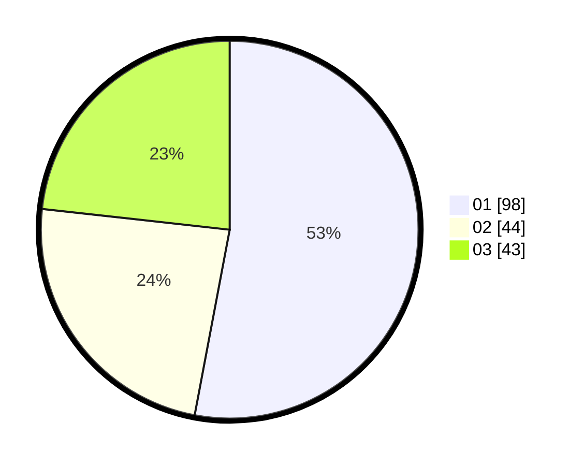

# Hasil

Hasil perolehan suara paslon dapat dilihat pada file paslon-01.txt, paslon-02.txt, dan paslon-03.txt.

Jika tidak ada, artinya data tersebut belum ada pada SIREKAP.

## Perolehan Suara

 * Paslon 01: **98**.
 * Paslon 02: **44**.
 * Paslon 03: **43**.

## Foto C Plano

https://sirekap-obj-formc.kpu.go.id/9098/pemilu/ppwp/31/74/01/10/02/3174011002040-20240216-220425--4a1b0253-26a4-4167-a510-43eed195c4ce.jpg

https://sirekap-obj-formc.kpu.go.id/9098/pemilu/ppwp/31/74/01/10/02/3174011002040-20240216-224533--0ca2b18d-c737-4e3d-b94b-69ea39006c16.jpg

https://sirekap-obj-formc.kpu.go.id/9098/pemilu/ppwp/31/74/01/10/02/3174011002040-20240216-221324--5e699b9a-a74a-47dc-95e4-71d5c7b324ae.jpg

## DATA PEMILIH TETAP

Jumlah pemilih dalam DPT: **208**.
 * L: **97**.
 * P: **111**.

## DATA PENGGUNA HAK PILIH

Jumlah pengguna hak pilih dalam DPT: **178**.
 * L: **81**.
 * P: **97**.

Jumlah pengguna hak pilih dalam DPTb: **9**.
 * L: **2**.
 * P: **7**.

Jumlah pengguna hak pilih dalam DPK: **0**.
 * L: **0**.
 * P: **0**.

Jumlah pengguna hak pilih: **187**.
 * L: **83**.
 * P: **104**.

## JUMLAH SUARA SAH DAN TIDAK SAH

JUMLAH SELURUH SUARA SAH: **185**.

JUMLAH SUARA TIDAK SAH: **2**.

JUMLAH SELURUH SUARA SAH DAN SUARA TIDAK SAH: **187**.
