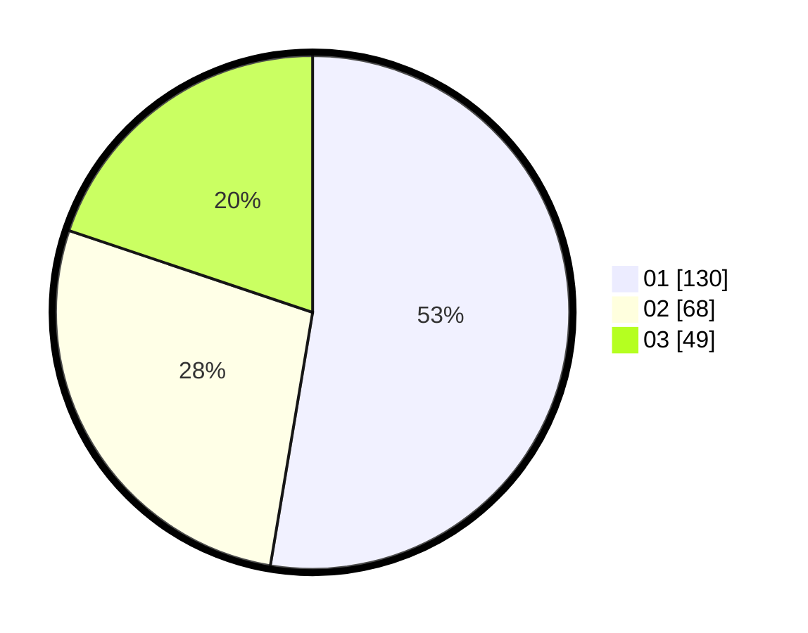

# Hasil

Hasil perolehan suara paslon dapat dilihat pada file paslon-01.txt, paslon-02.txt, dan paslon-03.txt.

Jika tidak ada, artinya data tersebut belum ada pada SIREKAP.

## Perolehan Suara

 * Paslon 01: **130**.
 * Paslon 02: **68**.
 * Paslon 03: **49**.

## Foto C Plano

https://sirekap-obj-formc.kpu.go.id/e5b8/pemilu/ppwp/31/74/01/10/02/3174011002052-20240215-221554--ea29aaf1-fd36-44ea-99f3-feb373207339.jpg

https://sirekap-obj-formc.kpu.go.id/e5b8/pemilu/ppwp/31/74/01/10/02/3174011002052-20240215-222256--24699fa1-3276-4a17-814e-00ad24145d03.jpg

https://sirekap-obj-formc.kpu.go.id/e5b8/pemilu/ppwp/31/74/01/10/02/3174011002052-20240215-222406--5d88cf56-f1d9-4b3f-82a4-09e10f939a05.jpg
