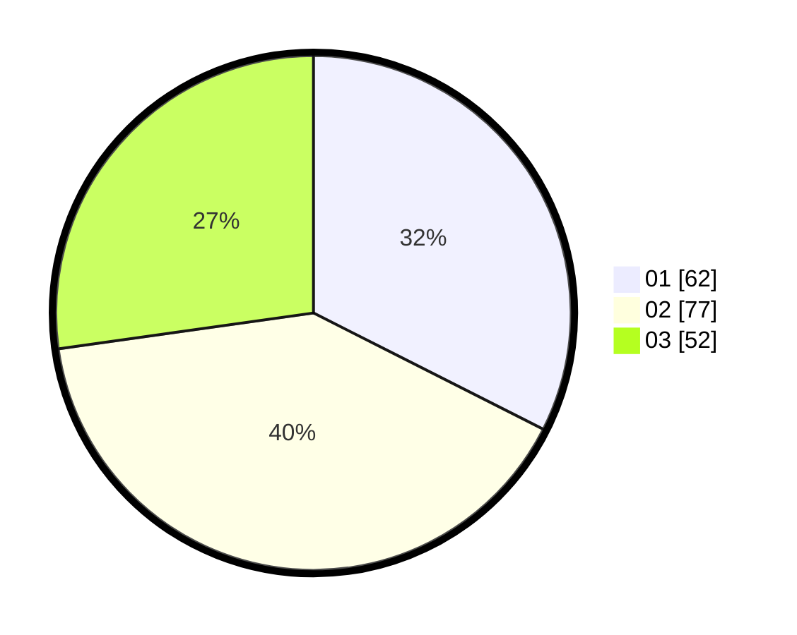

# Hasil

Hasil perolehan suara paslon dapat dilihat pada file paslon-01.txt, paslon-02.txt, dan paslon-03.txt.

Jika tidak ada, artinya data tersebut belum ada pada SIREKAP.

## Perolehan Suara

 * Paslon 01: **62**.
 * Paslon 02: **77**.
 * Paslon 03: **52**.

## Foto C Plano

https://sirekap-obj-formc.kpu.go.id/8bec/pemilu/ppwp/31/74/01/10/02/3174011002058-20240215-174616--55e3bb57-6da1-4229-8fb6-86876c70bd0d.jpg

https://sirekap-obj-formc.kpu.go.id/8bec/pemilu/ppwp/31/74/01/10/02/3174011002058-20240215-203516--90f10123-5c8a-4119-87bf-70d0c1aaff5d.jpg

https://sirekap-obj-formc.kpu.go.id/8bec/pemilu/ppwp/31/74/01/10/02/3174011002058-20240216-225055--2adadd5e-4dbe-469c-9463-fa4b26f61461.jpg

## DATA PEMILIH TETAP

Jumlah pemilih dalam DPT: **231**.
 * L: **114**.
 * P: **117**.

## DATA PENGGUNA HAK PILIH

Jumlah pengguna hak pilih dalam DPT: **174**.
 * L: **80**.
 * P: **94**.

Jumlah pengguna hak pilih dalam DPTb: **16**.
 * L: **6**.
 * P: **10**.

Jumlah pengguna hak pilih dalam DPK: **2**.
 * L: **1**.
 * P: **1**.

Jumlah pengguna hak pilih: **192**.
 * L: **87**.
 * P: **105**.

## JUMLAH SUARA SAH DAN TIDAK SAH

JUMLAH SELURUH SUARA SAH: **191**.

JUMLAH SUARA TIDAK SAH: **1**.

JUMLAH SELURUH SUARA SAH DAN SUARA TIDAK SAH: **192**.
