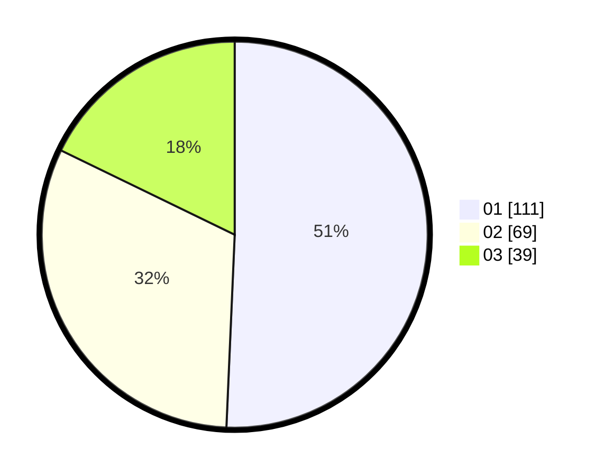

# Hasil

Hasil perolehan suara paslon dapat dilihat pada file paslon-01.txt, paslon-02.txt, dan paslon-03.txt.

Jika tidak ada, artinya data tersebut belum ada pada SIREKAP.

## Perolehan Suara

 * Paslon 01: **111**.
 * Paslon 02: **69**.
 * Paslon 03: **39**.

## Foto C Plano

https://sirekap-obj-formc.kpu.go.id/193c/pemilu/ppwp/31/74/01/10/02/3174011002060-20240214-215147--1df9ea68-3d91-4afd-a963-3c3b2ea94dba.jpg

https://sirekap-obj-formc.kpu.go.id/193c/pemilu/ppwp/31/74/01/10/02/3174011002060-20240214-215334--1af94bfa-391b-41a3-ac4b-95c8b01d5815.jpg

https://sirekap-obj-formc.kpu.go.id/193c/pemilu/ppwp/31/74/01/10/02/3174011002060-20240214-215509--0b627f71-1f45-4ef1-81cd-062cdaadd7fc.jpg
