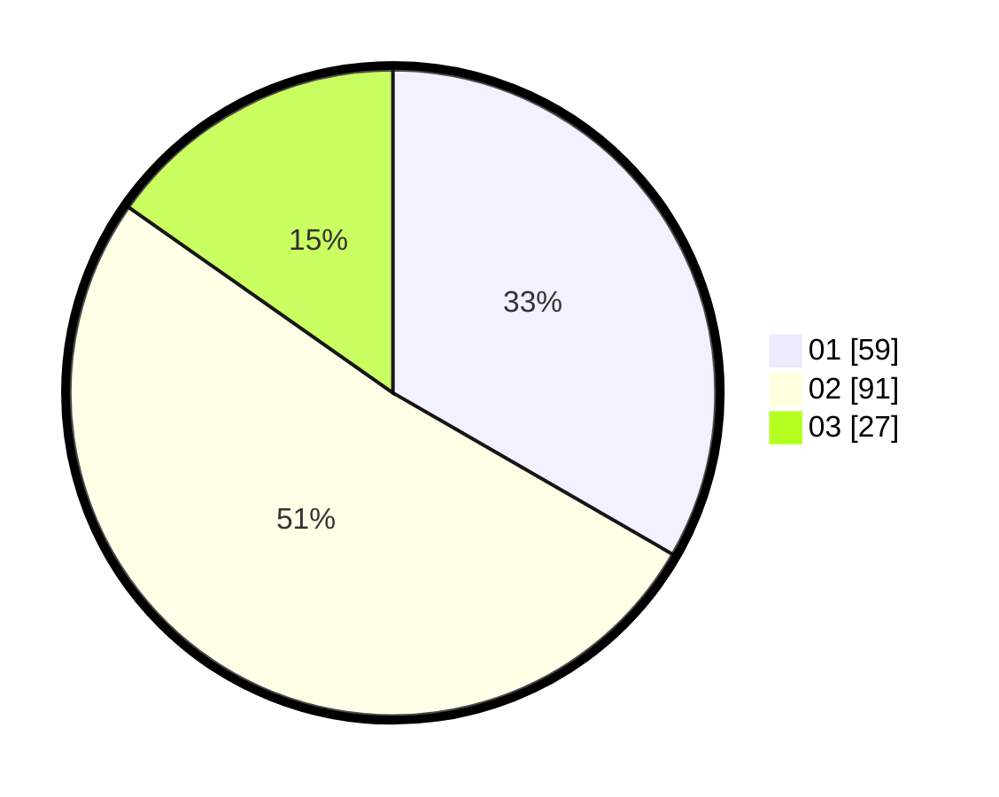

# Hasil

Hasil perolehan suara paslon dapat dilihat pada file paslon-01.txt, paslon-02.txt, dan paslon-03.txt.

Jika tidak ada, artinya data tersebut belum ada pada SIREKAP.

## Perolehan Suara

 * Paslon 01: **59**.
 * Paslon 02: **91**.
 * Paslon 03: **27**.

## Foto C Plano

https://sirekap-obj-formc.kpu.go.id/74be/pemilu/ppwp/31/74/01/10/02/3174011002068-20240214-210516--75869fc6-2928-4a84-89da-8185035ce5b1.jpg

https://sirekap-obj-formc.kpu.go.id/74be/pemilu/ppwp/31/74/01/10/02/3174011002068-20240214-210547--be10883f-9845-4b68-ba7e-a287e21dc23c.jpg

https://sirekap-obj-formc.kpu.go.id/74be/pemilu/ppwp/31/74/01/10/02/3174011002068-20240214-210608--d508d619-20b7-435a-a84c-30da17a47777.jpg

## DATA PEMILIH TETAP

Jumlah pemilih dalam DPT: **265**.
 * L: **131**.
 * P: **134**.

## DATA PENGGUNA HAK PILIH

Jumlah pengguna hak pilih dalam DPT: **175**.
 * L: **83**.
 * P: **92**.

Jumlah pengguna hak pilih dalam DPTb: **1**.
 * L: **1**.
 * P: **0**.

Jumlah pengguna hak pilih dalam DPK: **3**.
 * L: **0**.
 * P: **3**.

Jumlah pengguna hak pilih: **179**.
 * L: **84**.
 * P: **95**.

## JUMLAH SUARA SAH DAN TIDAK SAH

JUMLAH SELURUH SUARA SAH: **177**.

JUMLAH SUARA TIDAK SAH: **2**.

JUMLAH SELURUH SUARA SAH DAN SUARA TIDAK SAH: **179**.
