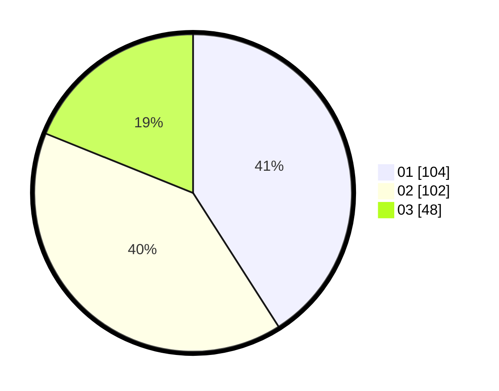

# Hasil

Hasil perolehan suara paslon dapat dilihat pada file paslon-01.txt, paslon-02.txt, dan paslon-03.txt.

Jika tidak ada, artinya data tersebut belum ada pada SIREKAP.

## Perolehan Suara

 * Paslon 01: **104**.
 * Paslon 02: **102**.
 * Paslon 03: **48**.

## Foto C Plano

https://sirekap-obj-formc.kpu.go.id/dd2d/pemilu/ppwp/31/74/01/10/02/3174011002072-20240214-193909--0db58649-53d6-4e40-8f7b-2ea14ac0abe8.jpg

https://sirekap-obj-formc.kpu.go.id/dd2d/pemilu/ppwp/31/74/01/10/02/3174011002072-20240214-193954--20ab3f1d-bebe-4a83-bd91-21c6e8ac481b.jpg

https://sirekap-obj-formc.kpu.go.id/dd2d/pemilu/ppwp/31/74/01/10/02/3174011002072-20240214-194020--dcc4bdfb-de3e-4eb3-83f0-2e6a47069a14.jpg

## DATA PEMILIH TETAP

Jumlah pemilih dalam DPT: **286**.
 * L: **138**.
 * P: **148**.

## DATA PENGGUNA HAK PILIH

Jumlah pengguna hak pilih dalam DPT: **241**.
 * L: **118**.
 * P: **123**.

Jumlah pengguna hak pilih dalam DPTb: **5**.
 * L: **2**.
 * P: **3**.

Jumlah pengguna hak pilih dalam DPK: **8**.
 * L: **3**.
 * P: **5**.

Jumlah pengguna hak pilih: **254**.
 * L: **123**.
 * P: **131**.

## JUMLAH SUARA SAH DAN TIDAK SAH

JUMLAH SELURUH SUARA SAH: **254**.

JUMLAH SUARA TIDAK SAH: **0**.

JUMLAH SELURUH SUARA SAH DAN SUARA TIDAK SAH: **254**.
