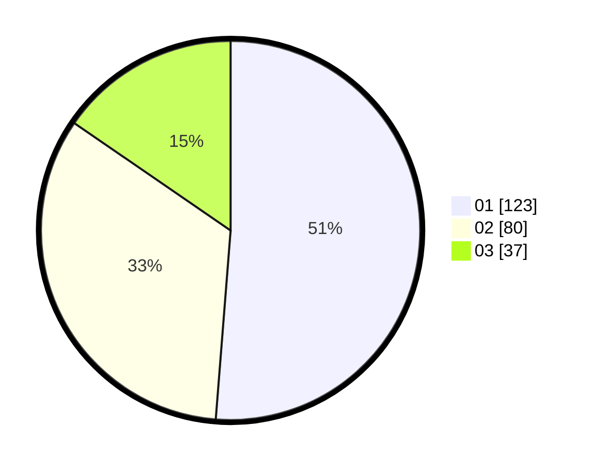

# Hasil

Hasil perolehan suara paslon dapat dilihat pada file paslon-01.txt, paslon-02.txt, dan paslon-03.txt.

Jika tidak ada, artinya data tersebut belum ada pada SIREKAP.

## Perolehan Suara

 * Paslon 01: **123**.
 * Paslon 02: **80**.
 * Paslon 03: **37**.

## Foto C Plano

https://sirekap-obj-formc.kpu.go.id/b7ce/pemilu/ppwp/31/74/01/10/03/3174011003001-20240214-195715--95a83de9-3643-4470-a975-b6d1b45f1151.jpg

https://sirekap-obj-formc.kpu.go.id/b7ce/pemilu/ppwp/31/74/01/10/03/3174011003001-20240214-205536--86332003-49fe-4cbd-b564-ddae964a33d9.jpg

https://sirekap-obj-formc.kpu.go.id/b7ce/pemilu/ppwp/31/74/01/10/03/3174011003001-20240214-201509--b33cec51-0469-4255-9025-c9c05365b48e.jpg
