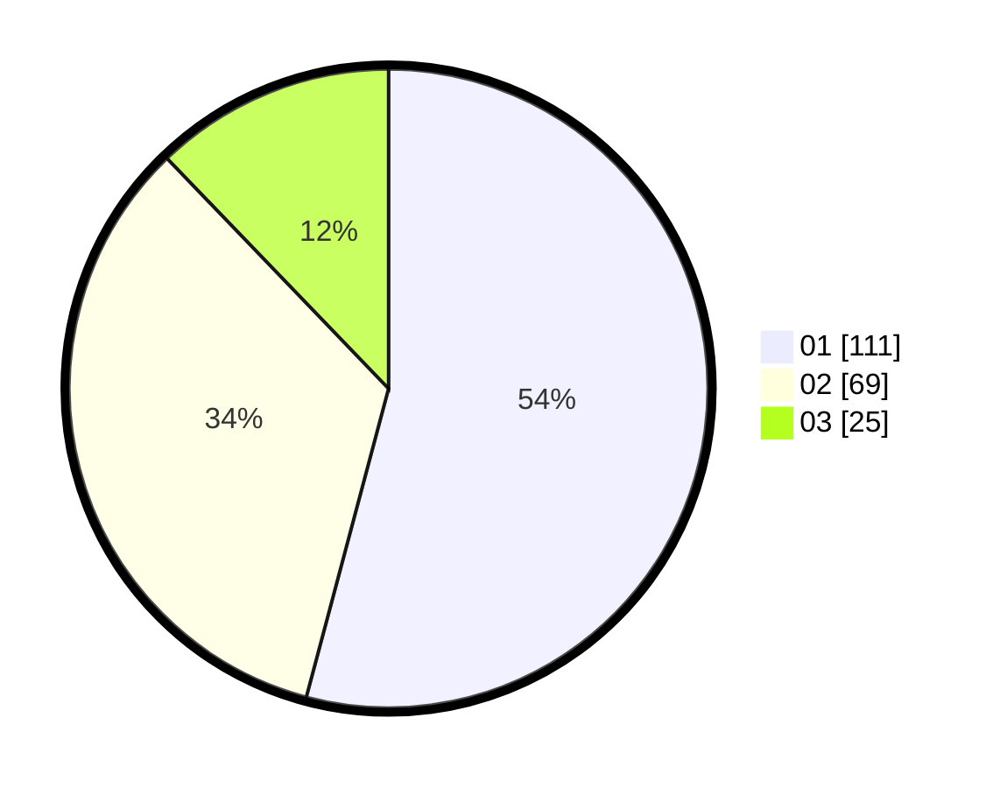

# Hasil

Hasil perolehan suara paslon dapat dilihat pada file paslon-01.txt, paslon-02.txt, dan paslon-03.txt.

Jika tidak ada, artinya data tersebut belum ada pada SIREKAP.

## Perolehan Suara

 * Paslon 01: **111**.
 * Paslon 02: **69**.
 * Paslon 03: **25**.

## Foto C Plano

https://sirekap-obj-formc.kpu.go.id/7ee7/pemilu/ppwp/31/74/01/10/03/3174011003005-20240214-190748--bacacd3f-169a-4f19-9d4e-b65c91273b76.jpg

https://sirekap-obj-formc.kpu.go.id/7ee7/pemilu/ppwp/31/74/01/10/03/3174011003005-20240214-200427--2b22b10b-5998-48e5-8e1d-25e0b21f845d.jpg

https://sirekap-obj-formc.kpu.go.id/7ee7/pemilu/ppwp/31/74/01/10/03/3174011003005-20240214-200614--c37d3aa4-29ac-449c-9b3a-912ba069a4b9.jpg

## DATA PEMILIH TETAP

Jumlah pemilih dalam DPT: **265**.
 * L: **127**.
 * P: **138**.

## DATA PENGGUNA HAK PILIH

Jumlah pengguna hak pilih dalam DPT: **202**.
 * L: **95**.
 * P: **107**.

Jumlah pengguna hak pilih dalam DPTb: **8**.
 * L: **3**.
 * P: **5**.

Jumlah pengguna hak pilih dalam DPK: **1**.
 * L: **1**.
 * P: **0**.

Jumlah pengguna hak pilih: **211**.
 * L: **99**.
 * P: **112**.

## JUMLAH SUARA SAH DAN TIDAK SAH

JUMLAH SELURUH SUARA SAH: **205**.

JUMLAH SUARA TIDAK SAH: **6**.

JUMLAH SELURUH SUARA SAH DAN SUARA TIDAK SAH: **211**.
