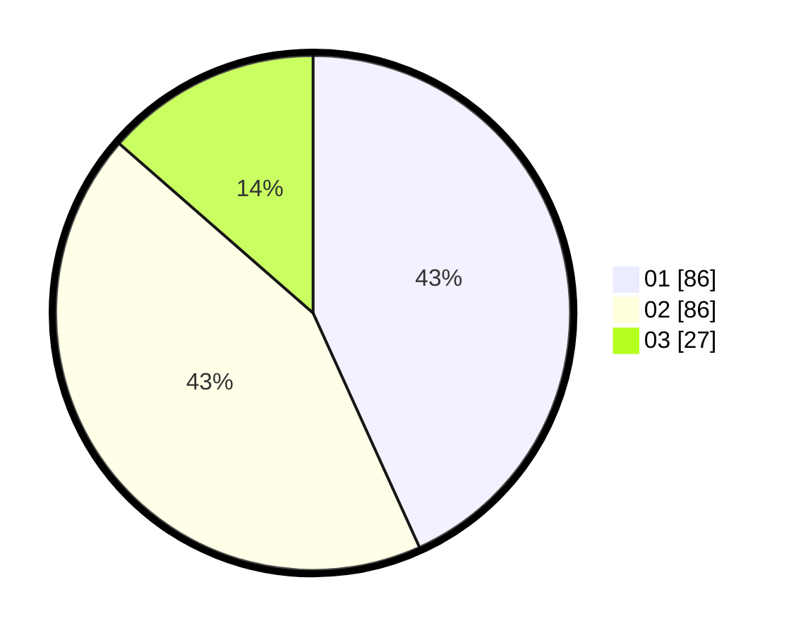

# Hasil

Hasil perolehan suara paslon dapat dilihat pada file paslon-01.txt, paslon-02.txt, dan paslon-03.txt.

Jika tidak ada, artinya data tersebut belum ada pada SIREKAP.

## Perolehan Suara

 * Paslon 01: **86**.
 * Paslon 02: **86**.
 * Paslon 03: **27**.

## Foto C Plano

https://sirekap-obj-formc.kpu.go.id/274d/pemilu/ppwp/31/74/01/10/03/3174011003006-20240214-233755--2f2bd89b-6d53-49a0-89cf-d0c983af7a6b.jpg

https://sirekap-obj-formc.kpu.go.id/274d/pemilu/ppwp/31/74/01/10/03/3174011003006-20240214-233806--96d3946b-0082-45b9-8de0-f55f04401ad4.jpg

https://sirekap-obj-formc.kpu.go.id/274d/pemilu/ppwp/31/74/01/10/03/3174011003006-20240214-233821--c827e561-d893-4344-b027-e30b0fa9094b.jpg
