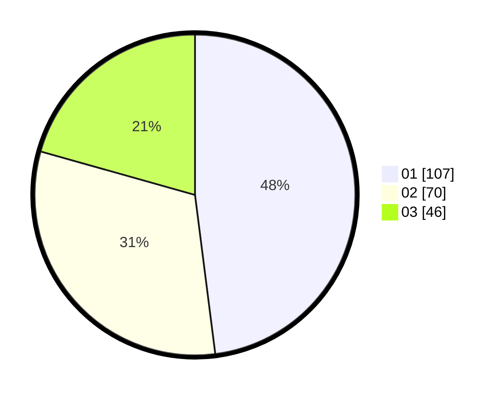

# Hasil

Hasil perolehan suara paslon dapat dilihat pada file paslon-01.txt, paslon-02.txt, dan paslon-03.txt.

Jika tidak ada, artinya data tersebut belum ada pada SIREKAP.

## Perolehan Suara

 * Paslon 01: **107**.
 * Paslon 02: **70**.
 * Paslon 03: **46**.

## Foto C Plano

https://sirekap-obj-formc.kpu.go.id/305c/pemilu/ppwp/31/74/01/10/03/3174011003014-20240218-182823--e08a72bc-293a-4e51-bb2b-66b2edff7f6e.jpg

https://sirekap-obj-formc.kpu.go.id/305c/pemilu/ppwp/31/74/01/10/03/3174011003014-20240218-182824--4dbb3770-f0b8-45f9-8829-c215a5ec2d15.jpg

https://sirekap-obj-formc.kpu.go.id/305c/pemilu/ppwp/31/74/01/10/03/3174011003014-20240218-182824--45895c25-1707-4891-856e-afc0d35fdb99.jpg

## DATA PEMILIH TETAP

Jumlah pemilih dalam DPT: **260**.
 * L: **130**.
 * P: **130**.

## DATA PENGGUNA HAK PILIH

Jumlah pengguna hak pilih dalam DPT: **214**.
 * L: **109**.
 * P: **105**.

Jumlah pengguna hak pilih dalam DPTb: **5**.
 * L: **1**.
 * P: **4**.

Jumlah pengguna hak pilih dalam DPK: **6**.
 * L: **3**.
 * P: **3**.

Jumlah pengguna hak pilih: **225**.
 * L: **113**.
 * P: **112**.

## JUMLAH SUARA SAH DAN TIDAK SAH

JUMLAH SELURUH SUARA SAH: **223**.

JUMLAH SUARA TIDAK SAH: **2**.

JUMLAH SELURUH SUARA SAH DAN SUARA TIDAK SAH: **225**.
