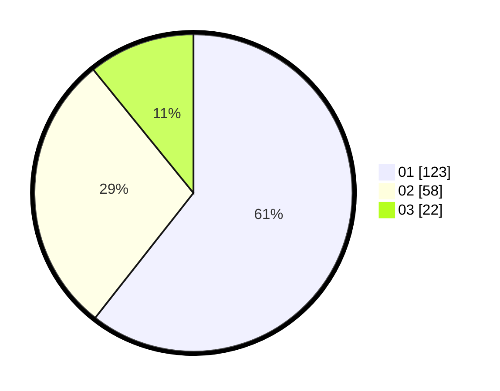

# Hasil

Hasil perolehan suara paslon dapat dilihat pada file paslon-01.txt, paslon-02.txt, dan paslon-03.txt.

Jika tidak ada, artinya data tersebut belum ada pada SIREKAP.

## Perolehan Suara

 * Paslon 01: **123**.
 * Paslon 02: **58**.
 * Paslon 03: **22**.

## Foto C Plano

https://sirekap-obj-formc.kpu.go.id/a3ed/pemilu/ppwp/31/74/01/10/03/3174011003015-20240214-234259--6075e08c-c265-4b41-92ce-30f891bccade.jpg

https://sirekap-obj-formc.kpu.go.id/a3ed/pemilu/ppwp/31/74/01/10/03/3174011003015-20240214-205325--0ecc83ec-336a-4a0d-ba04-9f380826f215.jpg

https://sirekap-obj-formc.kpu.go.id/a3ed/pemilu/ppwp/31/74/01/10/03/3174011003015-20240214-234435--d6253eba-3e87-4bbe-98e2-6ca0d6a10fbf.jpg

## DATA PEMILIH TETAP

Jumlah pemilih dalam DPT: **247**.
 * L: **117**.
 * P: **130**.

## DATA PENGGUNA HAK PILIH

Jumlah pengguna hak pilih dalam DPT: **202**.
 * L: **94**.
 * P: **108**.

Jumlah pengguna hak pilih dalam DPTb: **4**.
 * L: **1**.
 * P: **3**.

Jumlah pengguna hak pilih dalam DPK: **0**.
 * L: **0**.
 * P: **0**.

Jumlah pengguna hak pilih: **206**.
 * L: **95**.
 * P: **111**.

## JUMLAH SUARA SAH DAN TIDAK SAH

JUMLAH SELURUH SUARA SAH: **203**.

JUMLAH SUARA TIDAK SAH: **3**.

JUMLAH SELURUH SUARA SAH DAN SUARA TIDAK SAH: **206**.
