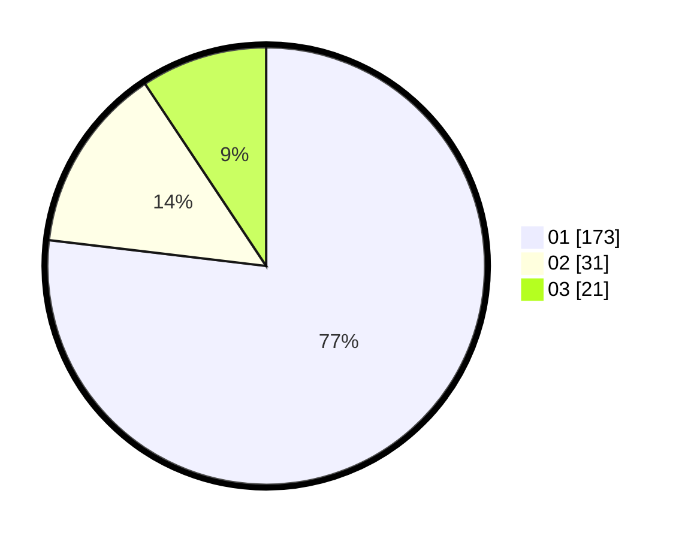

# Hasil

Hasil perolehan suara paslon dapat dilihat pada file paslon-01.txt, paslon-02.txt, dan paslon-03.txt.

Jika tidak ada, artinya data tersebut belum ada pada SIREKAP.

## Perolehan Suara

 * Paslon 01: **173**.
 * Paslon 02: **31**.
 * Paslon 03: **21**.

## Foto C Plano

https://sirekap-obj-formc.kpu.go.id/407e/pemilu/ppwp/31/74/01/10/03/3174011003017-20240214-184459--12aa2d2c-739a-46f2-b32f-8858833570b4.jpg

https://sirekap-obj-formc.kpu.go.id/407e/pemilu/ppwp/31/74/01/10/03/3174011003017-20240214-184439--a89329c6-73e0-4096-be1a-643b65a8814f.jpg

https://sirekap-obj-formc.kpu.go.id/407e/pemilu/ppwp/31/74/01/10/03/3174011003017-20240214-184506--3a7bacc3-61d9-48d5-991f-780333ce7bb8.jpg

## DATA PEMILIH TETAP

Jumlah pemilih dalam DPT: **259**.
 * L: **122**.
 * P: **137**.

## DATA PENGGUNA HAK PILIH

Jumlah pengguna hak pilih dalam DPT: **223**.
 * L: **103**.
 * P: **120**.

Jumlah pengguna hak pilih dalam DPTb: **1**.
 * L: **1**.
 * P: **0**.

Jumlah pengguna hak pilih dalam DPK: **4**.
 * L: **2**.
 * P: **2**.

Jumlah pengguna hak pilih: **228**.
 * L: **106**.
 * P: **122**.

## JUMLAH SUARA SAH DAN TIDAK SAH

JUMLAH SELURUH SUARA SAH: **225**.

JUMLAH SUARA TIDAK SAH: **3**.

JUMLAH SELURUH SUARA SAH DAN SUARA TIDAK SAH: **228**.
