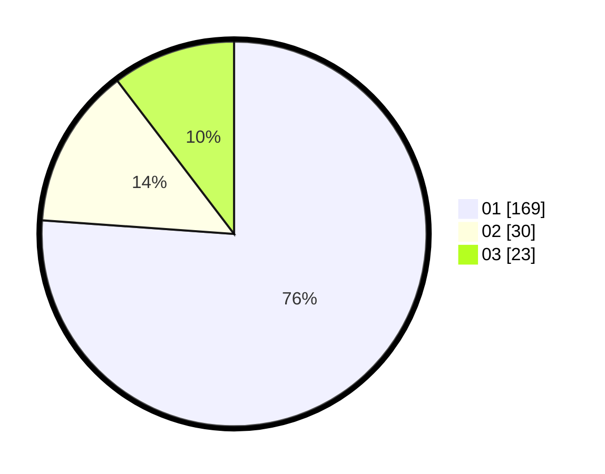

# Hasil

Hasil perolehan suara paslon dapat dilihat pada file paslon-01.txt, paslon-02.txt, dan paslon-03.txt.

Jika tidak ada, artinya data tersebut belum ada pada SIREKAP.

## Perolehan Suara

 * Paslon 01: **169**.
 * Paslon 02: **30**.
 * Paslon 03: **23**.

## Foto C Plano

https://sirekap-obj-formc.kpu.go.id/4945/pemilu/ppwp/31/74/01/10/03/3174011003021-20240214-155138--8082b887-8d9d-46cd-ae9a-451fc3cb46ce.jpg

https://sirekap-obj-formc.kpu.go.id/4945/pemilu/ppwp/31/74/01/10/03/3174011003021-20240214-155234--5156eb0b-5af5-45f3-b361-db27fbad9898.jpg

https://sirekap-obj-formc.kpu.go.id/4945/pemilu/ppwp/31/74/01/10/03/3174011003021-20240214-155034--b3a42519-7458-4c32-bd64-fba5efa9b22a.jpg

## DATA PEMILIH TETAP

Jumlah pemilih dalam DPT: **255**.
 * L: **116**.
 * P: **139**.

## DATA PENGGUNA HAK PILIH

Jumlah pengguna hak pilih dalam DPT: **220**.
 * L: **98**.
 * P: **122**.

Jumlah pengguna hak pilih dalam DPTb: **2**.
 * L: **1**.
 * P: **1**.

Jumlah pengguna hak pilih dalam DPK: **1**.
 * L: **0**.
 * P: **1**.

Jumlah pengguna hak pilih: **223**.
 * L: **94**.
 * P: **124**.

## JUMLAH SUARA SAH DAN TIDAK SAH

JUMLAH SELURUH SUARA SAH: **222**.

JUMLAH SUARA TIDAK SAH: **1**.

JUMLAH SELURUH SUARA SAH DAN SUARA TIDAK SAH: **223**.
