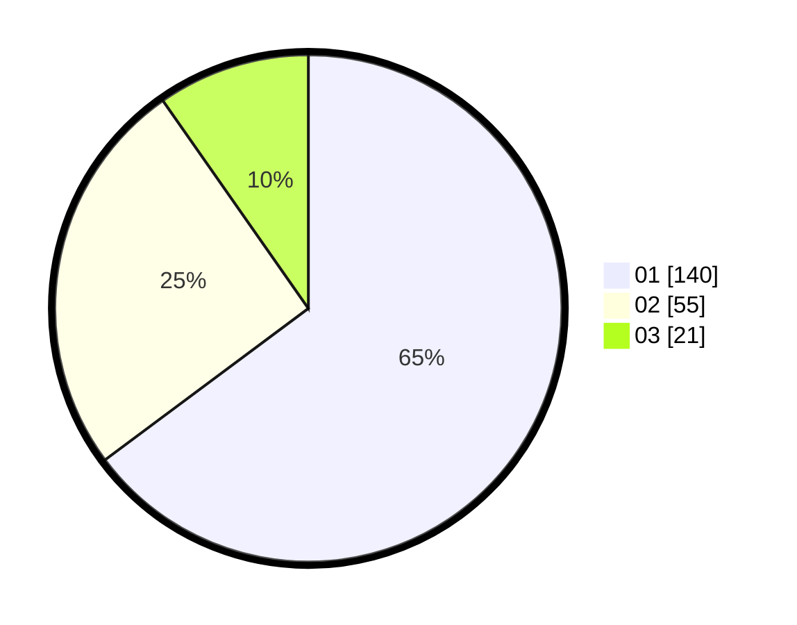

# Hasil

Hasil perolehan suara paslon dapat dilihat pada file paslon-01.txt, paslon-02.txt, dan paslon-03.txt.

Jika tidak ada, artinya data tersebut belum ada pada SIREKAP.

## Perolehan Suara

 * Paslon 01: **140**.
 * Paslon 02: **55**.
 * Paslon 03: **21**.

## Foto C Plano

https://sirekap-obj-formc.kpu.go.id/1328/pemilu/ppwp/31/74/01/10/03/3174011003025-20240214-230641--a58dc097-b974-4cb2-9c33-12aa41b36b7a.jpg

https://sirekap-obj-formc.kpu.go.id/1328/pemilu/ppwp/31/74/01/10/03/3174011003025-20240214-230754--eebbc9d2-0200-47ba-8123-b48d9c6e7365.jpg

https://sirekap-obj-formc.kpu.go.id/1328/pemilu/ppwp/31/74/01/10/03/3174011003025-20240214-230837--2437a1c4-17ef-4f06-8eb1-b761d9672528.jpg

## DATA PEMILIH TETAP

Jumlah pemilih dalam DPT: **222**.
 * L: **103**.
 * P: **119**.

## DATA PENGGUNA HAK PILIH

Jumlah pengguna hak pilih dalam DPT: **115**.
 * L: **101**.
 * P: **114**.

Jumlah pengguna hak pilih dalam DPTb: **7**.
 * L: **2**.
 * P: **5**.

Jumlah pengguna hak pilih dalam DPK: **0**.
 * L: **0**.
 * P: **0**.

Jumlah pengguna hak pilih: **222**.
 * L: **103**.
 * P: **119**.

## JUMLAH SUARA SAH DAN TIDAK SAH

JUMLAH SELURUH SUARA SAH: **216**.

JUMLAH SUARA TIDAK SAH: **6**.

JUMLAH SELURUH SUARA SAH DAN SUARA TIDAK SAH: **222**.
