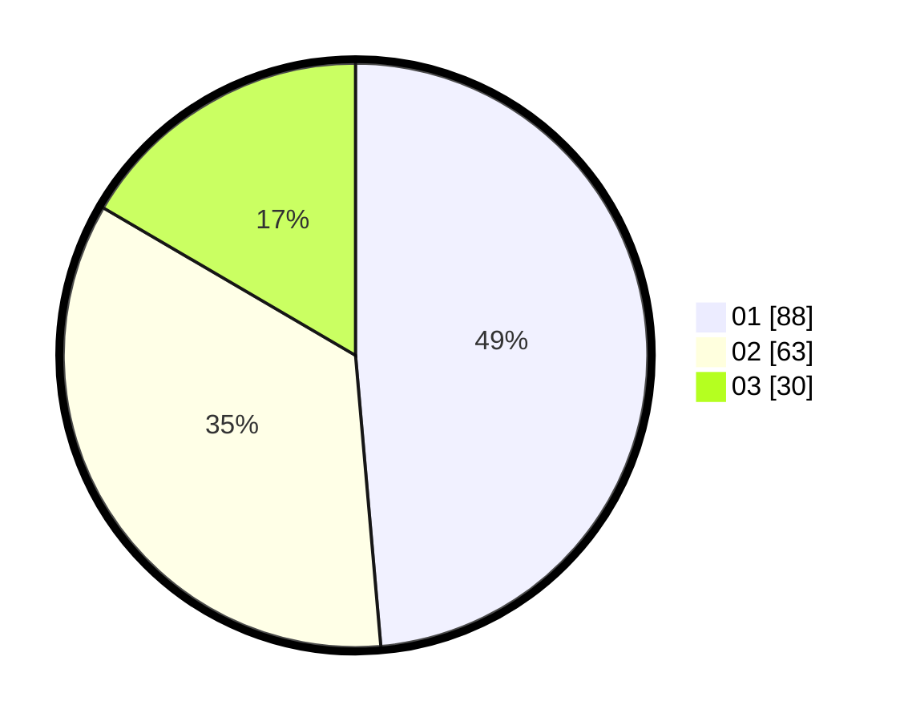

# Hasil

Hasil perolehan suara paslon dapat dilihat pada file paslon-01.txt, paslon-02.txt, dan paslon-03.txt.

Jika tidak ada, artinya data tersebut belum ada pada SIREKAP.

## Perolehan Suara

 * Paslon 01: **88**.
 * Paslon 02: **63**.
 * Paslon 03: **30**.

## Foto C Plano

https://sirekap-obj-formc.kpu.go.id/a4fd/pemilu/ppwp/31/74/01/10/03/3174011003031-20240214-205814--02d3aa0b-f4ef-4a33-ae69-fb7722058993.jpg

https://sirekap-obj-formc.kpu.go.id/a4fd/pemilu/ppwp/31/74/01/10/03/3174011003031-20240214-195454--ea0ee6c6-ffe9-41e3-a47c-318de906a82e.jpg

https://sirekap-obj-formc.kpu.go.id/a4fd/pemilu/ppwp/31/74/01/10/03/3174011003031-20240214-205958--dd9f1f47-0a6e-4ec3-8629-650899f68e5e.jpg

## DATA PEMILIH TETAP

Jumlah pemilih dalam DPT: **269**.
 * L: **106**.
 * P: **113**.

## DATA PENGGUNA HAK PILIH

Jumlah pengguna hak pilih dalam DPT: **179**.
 * L: **88**.
 * P: **91**.

Jumlah pengguna hak pilih dalam DPTb: **5**.
 * L: **2**.
 * P: **3**.

Jumlah pengguna hak pilih dalam DPK: **0**.
 * L: **0**.
 * P: **0**.

Jumlah pengguna hak pilih: **184**.
 * L: **90**.
 * P: **94**.

## JUMLAH SUARA SAH DAN TIDAK SAH

JUMLAH SELURUH SUARA SAH: **181**.

JUMLAH SUARA TIDAK SAH: **3**.

JUMLAH SELURUH SUARA SAH DAN SUARA TIDAK SAH: **184**.
