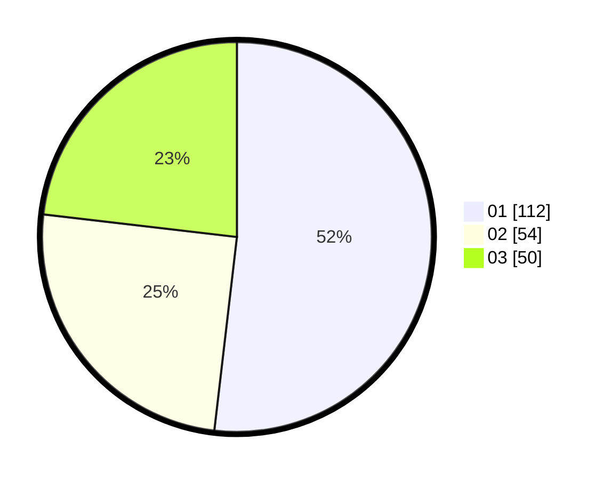

# Hasil

Hasil perolehan suara paslon dapat dilihat pada file paslon-01.txt, paslon-02.txt, dan paslon-03.txt.

Jika tidak ada, artinya data tersebut belum ada pada SIREKAP.

## Perolehan Suara

 * Paslon 01: **112**.
 * Paslon 02: **54**.
 * Paslon 03: **50**.

## Foto C Plano

https://sirekap-obj-formc.kpu.go.id/d1d9/pemilu/ppwp/31/74/01/10/03/3174011003033-20240214-195332--1cea2628-032a-4fad-8ae1-b91e551f3786.jpg

https://sirekap-obj-formc.kpu.go.id/d1d9/pemilu/ppwp/31/74/01/10/03/3174011003033-20240214-195439--78a36ae6-8ffe-456a-912d-bf29e0bec141.jpg

https://sirekap-obj-formc.kpu.go.id/d1d9/pemilu/ppwp/31/74/01/10/03/3174011003033-20240214-195552--21d7f57a-2fd9-4a0a-8e54-fc0ae2ae9f51.jpg

## DATA PEMILIH TETAP

Jumlah pemilih dalam DPT: **264**.
 * L: **129**.
 * P: **135**.

## DATA PENGGUNA HAK PILIH

Jumlah pengguna hak pilih dalam DPT: **211**.
 * L: **102**.
 * P: **109**.

Jumlah pengguna hak pilih dalam DPTb: **5**.
 * L: **2**.
 * P: **3**.

Jumlah pengguna hak pilih dalam DPK: **0**.
 * L: **0**.
 * P: **0**.

Jumlah pengguna hak pilih: **216**.
 * L: **104**.
 * P: **112**.

## JUMLAH SUARA SAH DAN TIDAK SAH

JUMLAH SELURUH SUARA SAH: **216**.

JUMLAH SUARA TIDAK SAH: **0**.

JUMLAH SELURUH SUARA SAH DAN SUARA TIDAK SAH: **216**.
