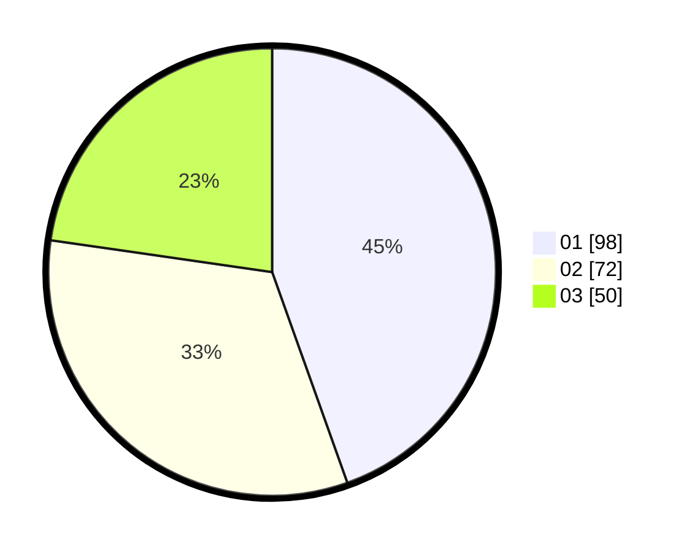

# Hasil

Hasil perolehan suara paslon dapat dilihat pada file paslon-01.txt, paslon-02.txt, dan paslon-03.txt.

Jika tidak ada, artinya data tersebut belum ada pada SIREKAP.

## Perolehan Suara

 * Paslon 01: **98**.
 * Paslon 02: **72**.
 * Paslon 03: **50**.

## Foto C Plano

https://sirekap-obj-formc.kpu.go.id/19fc/pemilu/ppwp/31/74/01/10/03/3174011003040-20240216-142121--47dfdb0c-c0a4-46c3-92c5-18c5317c3e14.jpg

https://sirekap-obj-formc.kpu.go.id/19fc/pemilu/ppwp/31/74/01/10/03/3174011003040-20240216-142123--503b701c-0f97-413a-a2d3-1de0fbe8ba73.jpg

https://sirekap-obj-formc.kpu.go.id/19fc/pemilu/ppwp/31/74/01/10/03/3174011003040-20240216-142122--1f05ed50-c184-49e9-823c-93671a536dfb.jpg

## DATA PEMILIH TETAP

Jumlah pemilih dalam DPT: **264**.
 * L: **126**.
 * P: **138**.

## DATA PENGGUNA HAK PILIH

Jumlah pengguna hak pilih dalam DPT: **224**.
 * L: **105**.
 * P: **119**.

Jumlah pengguna hak pilih dalam DPTb: **4**.
 * L: **1**.
 * P: **3**.

Jumlah pengguna hak pilih dalam DPK: **0**.
 * L: **0**.
 * P: **0**.

Jumlah pengguna hak pilih: **228**.
 * L: **106**.
 * P: **122**.

## JUMLAH SUARA SAH DAN TIDAK SAH

JUMLAH SELURUH SUARA SAH: **220**.

JUMLAH SUARA TIDAK SAH: **8**.

JUMLAH SELURUH SUARA SAH DAN SUARA TIDAK SAH: **228**.
