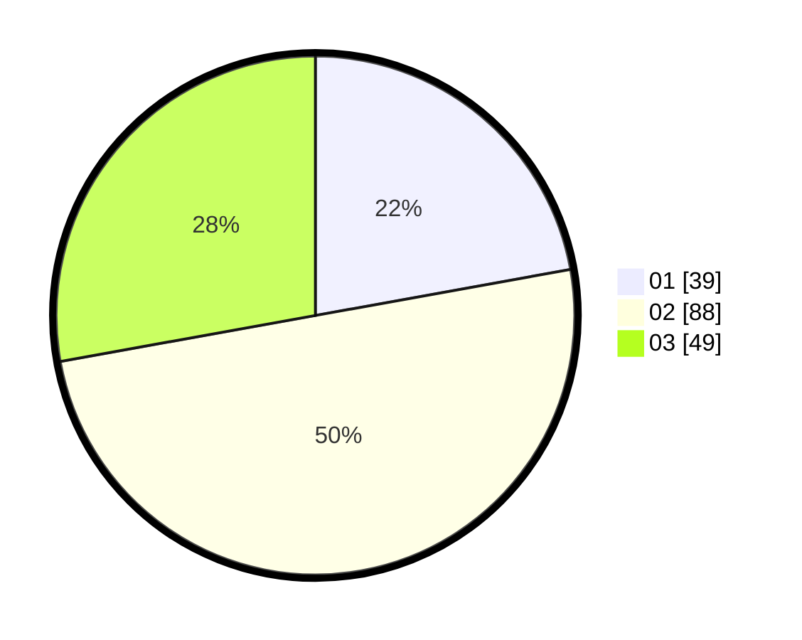

# Hasil

Hasil perolehan suara paslon dapat dilihat pada file paslon-01.txt, paslon-02.txt, dan paslon-03.txt.

Jika tidak ada, artinya data tersebut belum ada pada SIREKAP.

## Perolehan Suara

 * Paslon 01: **39**.
 * Paslon 02: **88**.
 * Paslon 03: **49**.

## Foto C Plano

https://sirekap-obj-formc.kpu.go.id/f715/pemilu/ppwp/31/74/01/10/03/3174011003052-20240214-155036--0df21a1f-4d49-4e7e-8c5d-e34641d0d6b2.jpg

https://sirekap-obj-formc.kpu.go.id/f715/pemilu/ppwp/31/74/01/10/03/3174011003052-20240214-155117--1127ec0f-1a21-4af8-85ae-6eba5e776d8e.jpg

https://sirekap-obj-formc.kpu.go.id/f715/pemilu/ppwp/31/74/01/10/03/3174011003052-20240214-155210--f6e3a06a-1261-46e9-a7fe-4f673e4070aa.jpg

## DATA PEMILIH TETAP

Jumlah pemilih dalam DPT: **235**.
 * L: **119**.
 * P: **116**.

## DATA PENGGUNA HAK PILIH

Jumlah pengguna hak pilih dalam DPT: **169**.
 * L: **90**.
 * P: **79**.

Jumlah pengguna hak pilih dalam DPTb: **7**.
 * L: **4**.
 * P: **3**.

Jumlah pengguna hak pilih dalam DPK: **3**.
 * L: **2**.
 * P: **1**.

Jumlah pengguna hak pilih: **179**.
 * L: **96**.
 * P: **83**.

## JUMLAH SUARA SAH DAN TIDAK SAH

JUMLAH SELURUH SUARA SAH: **176**.

JUMLAH SUARA TIDAK SAH: **3**.

JUMLAH SELURUH SUARA SAH DAN SUARA TIDAK SAH: **179**.
