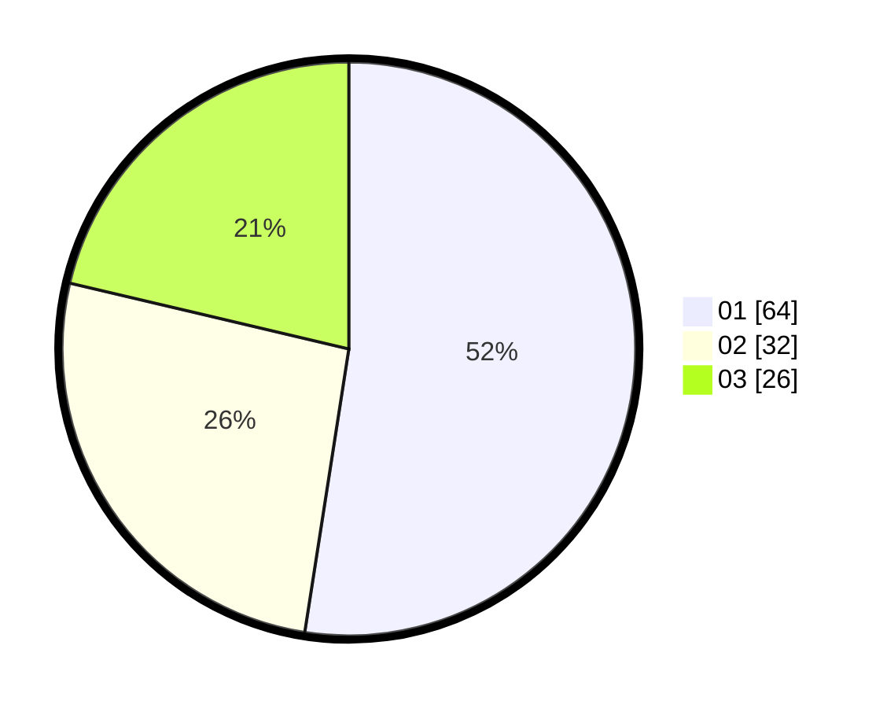

# Hasil

Hasil perolehan suara paslon dapat dilihat pada file paslon-01.txt, paslon-02.txt, dan paslon-03.txt.

Jika tidak ada, artinya data tersebut belum ada pada SIREKAP.

## Perolehan Suara

 * Paslon 01: **64**.
 * Paslon 02: **32**.
 * Paslon 03: **26**.

## Foto C Plano

https://sirekap-obj-formc.kpu.go.id/1a70/pemilu/ppwp/31/74/01/10/03/3174011003054-20240214-201114--66d23484-3c24-4f8f-86bf-ffafe4579453.jpg

https://sirekap-obj-formc.kpu.go.id/1a70/pemilu/ppwp/31/74/01/10/03/3174011003054-20240214-201319--18de768f-6021-4a4f-a950-f24ea1c7e824.jpg

https://sirekap-obj-formc.kpu.go.id/1a70/pemilu/ppwp/31/74/01/10/03/3174011003054-20240214-204149--35e0f288-5100-4429-aad5-47ad90b50168.jpg
