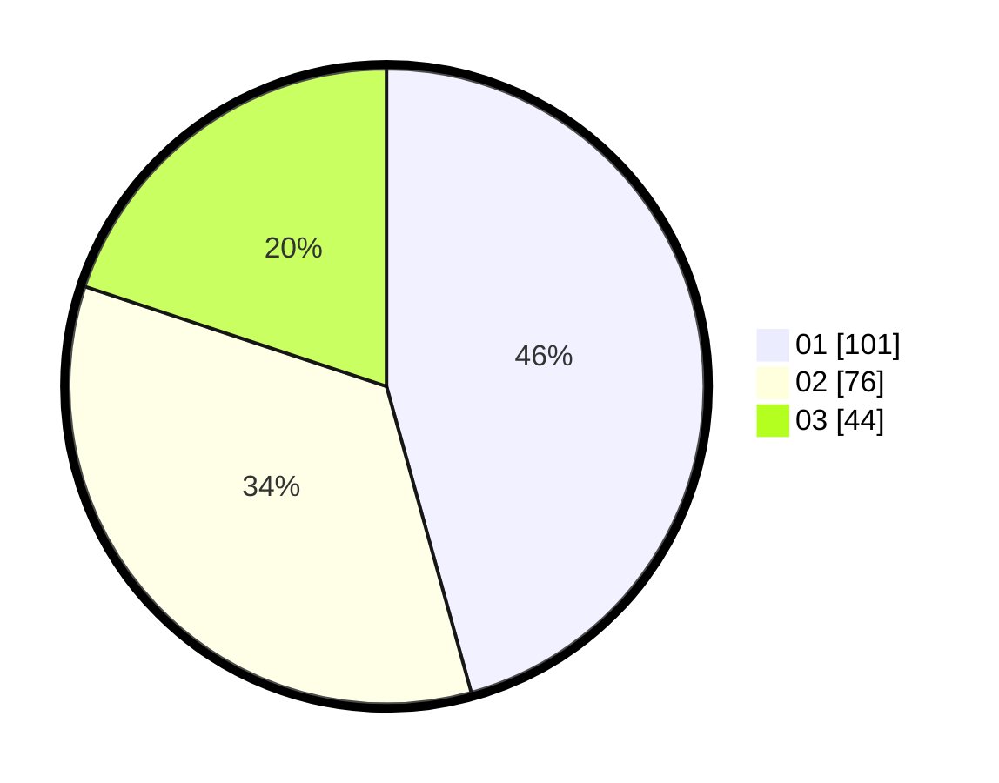

# Hasil

Hasil perolehan suara paslon dapat dilihat pada file paslon-01.txt, paslon-02.txt, dan paslon-03.txt.

Jika tidak ada, artinya data tersebut belum ada pada SIREKAP.

## Perolehan Suara

 * Paslon 01: **101**.
 * Paslon 02: **76**.
 * Paslon 03: **44**.

## Foto C Plano

https://sirekap-obj-formc.kpu.go.id/3c70/pemilu/ppwp/31/74/01/10/03/3174011003056-20240214-234834--41c5ba23-cef0-4873-b2af-b276d6b48cdc.jpg

https://sirekap-obj-formc.kpu.go.id/3c70/pemilu/ppwp/31/74/01/10/03/3174011003056-20240214-231435--56706164-1fe4-4f3b-b3c6-5ef62e2798db.jpg

https://sirekap-obj-formc.kpu.go.id/3c70/pemilu/ppwp/31/74/01/10/03/3174011003056-20240214-231509--a071c6d9-032d-4ea4-81c8-f99065c7e5ae.jpg

## DATA PEMILIH TETAP

Jumlah pemilih dalam DPT: **268**.
 * L: **128**.
 * P: **140**.

## DATA PENGGUNA HAK PILIH

Jumlah pengguna hak pilih dalam DPT: **224**.
 * L: **102**.
 * P: **122**.

Jumlah pengguna hak pilih dalam DPTb: **4**.
 * L: **1**.
 * P: **3**.

Jumlah pengguna hak pilih dalam DPK: **0**.
 * L: **0**.
 * P: **0**.

Jumlah pengguna hak pilih: **228**.
 * L: **103**.
 * P: **125**.

## JUMLAH SUARA SAH DAN TIDAK SAH

JUMLAH SELURUH SUARA SAH: **227**.

JUMLAH SUARA TIDAK SAH: **1**.

JUMLAH SELURUH SUARA SAH DAN SUARA TIDAK SAH: **228**.
