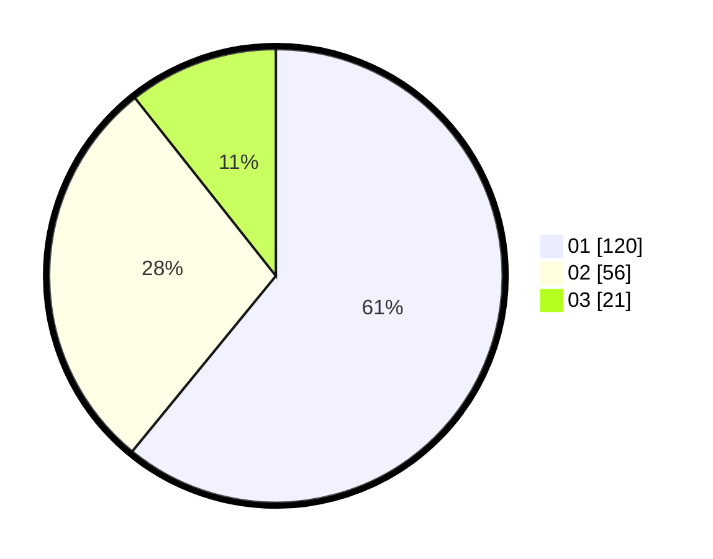

# Hasil

Hasil perolehan suara paslon dapat dilihat pada file paslon-01.txt, paslon-02.txt, dan paslon-03.txt.

Jika tidak ada, artinya data tersebut belum ada pada SIREKAP.

## Perolehan Suara

 * Paslon 01: **120**.
 * Paslon 02: **56**.
 * Paslon 03: **21**.

## Foto C Plano

https://sirekap-obj-formc.kpu.go.id/d43d/pemilu/ppwp/31/74/01/10/03/3174011003058-20240214-201142--d88376b6-a357-42aa-af20-15c6f52fcfdb.jpg

https://sirekap-obj-formc.kpu.go.id/d43d/pemilu/ppwp/31/74/01/10/03/3174011003058-20240214-201144--f7da015b-d264-46fa-9390-d7032a285489.jpg

https://sirekap-obj-formc.kpu.go.id/d43d/pemilu/ppwp/31/74/01/10/03/3174011003058-20240214-201147--f3b6df29-f782-4705-8d93-ecf9a695e6b3.jpg

## DATA PEMILIH TETAP

Jumlah pemilih dalam DPT: **241**.
 * L: **116**.
 * P: **125**.

## DATA PENGGUNA HAK PILIH

Jumlah pengguna hak pilih dalam DPT: **188**.
 * L: **87**.
 * P: **101**.

Jumlah pengguna hak pilih dalam DPTb: **6**.
 * L: **3**.
 * P: **3**.

Jumlah pengguna hak pilih dalam DPK: **4**.
 * L: **1**.
 * P: **3**.

Jumlah pengguna hak pilih: **198**.
 * L: **91**.
 * P: **107**.

## JUMLAH SUARA SAH DAN TIDAK SAH

JUMLAH SELURUH SUARA SAH: **197**.

JUMLAH SUARA TIDAK SAH: **1**.

JUMLAH SELURUH SUARA SAH DAN SUARA TIDAK SAH: **198**.
