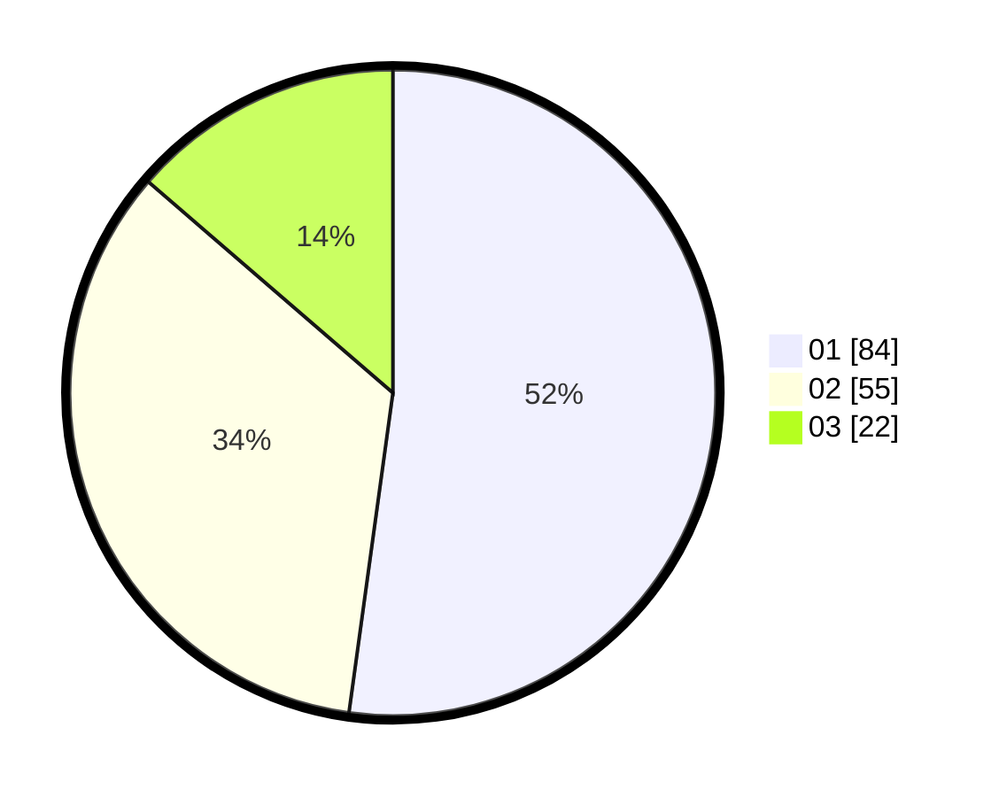

# Hasil

Hasil perolehan suara paslon dapat dilihat pada file paslon-01.txt, paslon-02.txt, dan paslon-03.txt.

Jika tidak ada, artinya data tersebut belum ada pada SIREKAP.

## Perolehan Suara

 * Paslon 01: **84**.
 * Paslon 02: **55**.
 * Paslon 03: **22**.

## Foto C Plano

https://sirekap-obj-formc.kpu.go.id/81b8/pemilu/ppwp/31/74/01/10/03/3174011003060-20240216-053853--c24d9dbf-22db-4fb6-90dd-dc802d67e317.jpg

https://sirekap-obj-formc.kpu.go.id/81b8/pemilu/ppwp/31/74/01/10/03/3174011003060-20240216-053855--eb137857-c081-4e16-a531-ec672af9f213.jpg

https://sirekap-obj-formc.kpu.go.id/81b8/pemilu/ppwp/31/74/01/10/03/3174011003060-20240216-053854--dfe2e8a7-e7b8-400c-8890-47b3235151ab.jpg

## DATA PEMILIH TETAP

Jumlah pemilih dalam DPT: **212**.
 * L: **112**.
 * P: **100**.

## DATA PENGGUNA HAK PILIH

Jumlah pengguna hak pilih dalam DPT: **163**.
 * L: **79**.
 * P: **84**.

Jumlah pengguna hak pilih dalam DPTb: **0**.
 * L: **0**.
 * P: **0**.

Jumlah pengguna hak pilih dalam DPK: **1**.
 * L: **0**.
 * P: **1**.

Jumlah pengguna hak pilih: **164**.
 * L: **79**.
 * P: **85**.

## JUMLAH SUARA SAH DAN TIDAK SAH

JUMLAH SELURUH SUARA SAH: **161**.

JUMLAH SUARA TIDAK SAH: **3**.

JUMLAH SELURUH SUARA SAH DAN SUARA TIDAK SAH: **164**.
