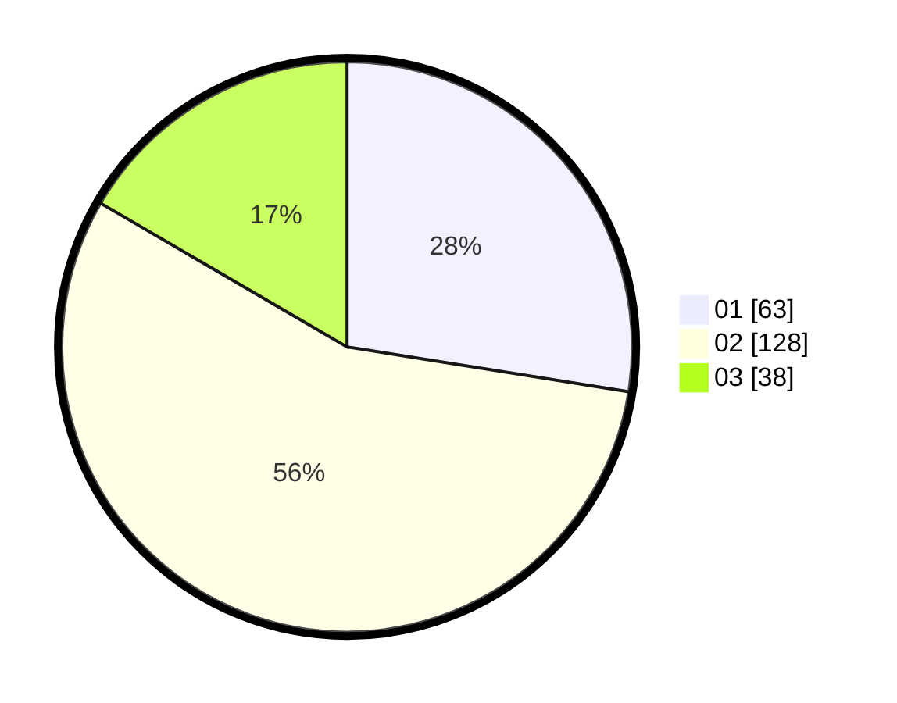

# Hasil

Hasil perolehan suara paslon dapat dilihat pada file paslon-01.txt, paslon-02.txt, dan paslon-03.txt.

Jika tidak ada, artinya data tersebut belum ada pada SIREKAP.

## Perolehan Suara

 * Paslon 01: **63**.
 * Paslon 02: **128**.
 * Paslon 03: **38**.

## Foto C Plano

https://sirekap-obj-formc.kpu.go.id/fa7d/pemilu/ppwp/31/74/01/10/03/3174011003063-20240214-212100--4e1ad3aa-a636-4a48-9441-ce82837c32d1.jpg

https://sirekap-obj-formc.kpu.go.id/fa7d/pemilu/ppwp/31/74/01/10/03/3174011003063-20240214-212106--e09803aa-da96-4d9a-8921-dfbb4560277e.jpg

https://sirekap-obj-formc.kpu.go.id/fa7d/pemilu/ppwp/31/74/01/10/03/3174011003063-20240214-212111--f4347683-4b86-4d16-8c19-566905873a56.jpg

## DATA PEMILIH TETAP

Jumlah pemilih dalam DPT: **280**.
 * L: **135**.
 * P: **145**.

## DATA PENGGUNA HAK PILIH

Jumlah pengguna hak pilih dalam DPT: **221**.
 * L: **107**.
 * P: **114**.

Jumlah pengguna hak pilih dalam DPTb: **8**.
 * L: **3**.
 * P: **5**.

Jumlah pengguna hak pilih dalam DPK: **0**.
 * L: **0**.
 * P: **0**.

Jumlah pengguna hak pilih: **229**.
 * L: **110**.
 * P: **119**.

## JUMLAH SUARA SAH DAN TIDAK SAH

JUMLAH SELURUH SUARA SAH: **229**.

JUMLAH SUARA TIDAK SAH: **0**.

JUMLAH SELURUH SUARA SAH DAN SUARA TIDAK SAH: **229**.
