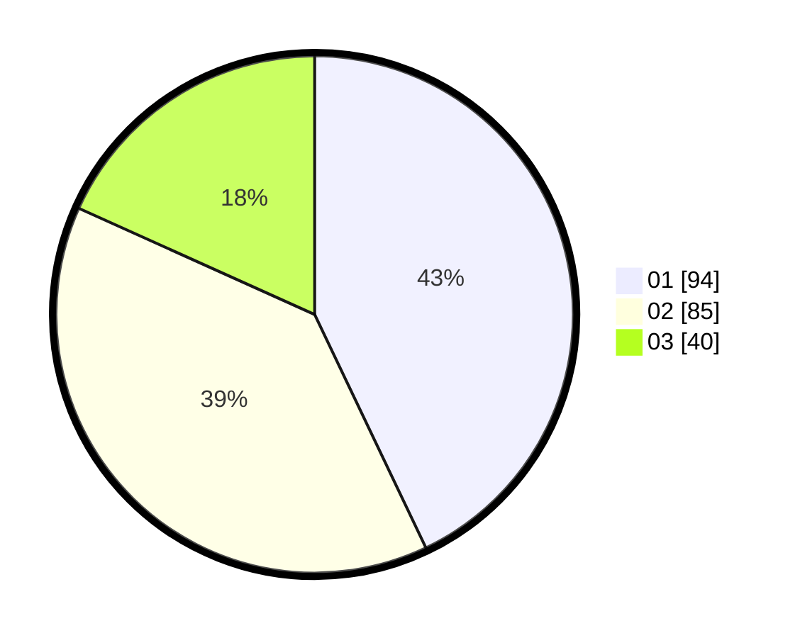

# Hasil

Hasil perolehan suara paslon dapat dilihat pada file paslon-01.txt, paslon-02.txt, dan paslon-03.txt.

Jika tidak ada, artinya data tersebut belum ada pada SIREKAP.

## Perolehan Suara

 * Paslon 01: **94**.
 * Paslon 02: **85**.
 * Paslon 03: **40**.

## Foto C Plano

https://sirekap-obj-formc.kpu.go.id/8d85/pemilu/ppwp/31/74/01/10/03/3174011003064-20240214-215104--09cd8ad5-ba0c-42af-a3fa-058c1b145b6f.jpg

https://sirekap-obj-formc.kpu.go.id/8d85/pemilu/ppwp/31/74/01/10/03/3174011003064-20240215-023702--34743e00-e4a6-4769-95d7-95a5bc6c7562.jpg
