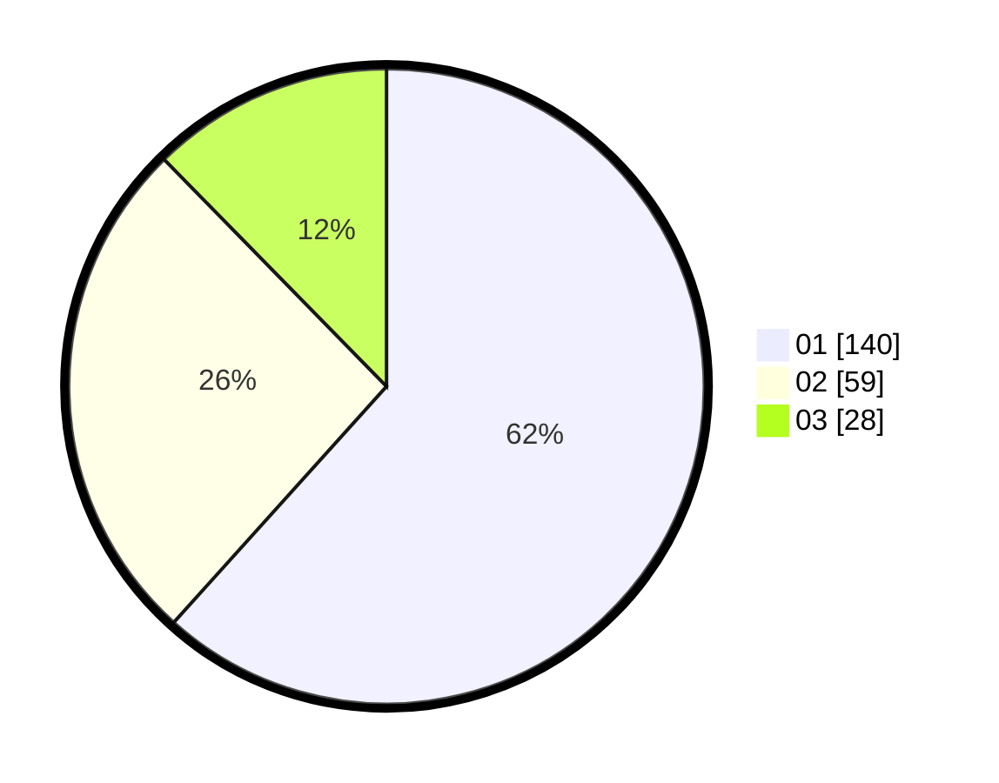

# Hasil

Hasil perolehan suara paslon dapat dilihat pada file paslon-01.txt, paslon-02.txt, dan paslon-03.txt.

Jika tidak ada, artinya data tersebut belum ada pada SIREKAP.

## Perolehan Suara

 * Paslon 01: **140**.
 * Paslon 02: **59**.
 * Paslon 03: **28**.

## Foto C Plano

https://sirekap-obj-formc.kpu.go.id/5c26/pemilu/ppwp/31/74/01/10/03/3174011003065-20240214-203235--cf74fde5-51ba-4ec5-a108-ade2e45b99ab.jpg

https://sirekap-obj-formc.kpu.go.id/5c26/pemilu/ppwp/31/74/01/10/03/3174011003065-20240214-203332--0d9883e5-0486-4e0c-8aed-a2fd8ef9eb76.jpg

https://sirekap-obj-formc.kpu.go.id/5c26/pemilu/ppwp/31/74/01/10/03/3174011003065-20240214-203408--e4cffc50-4c5d-43ed-b97d-01bfbd5473f3.jpg

## DATA PEMILIH TETAP

Jumlah pemilih dalam DPT: **275**.
 * L: **133**.
 * P: **142**.

## DATA PENGGUNA HAK PILIH

Jumlah pengguna hak pilih dalam DPT: **219**.
 * L: **104**.
 * P: **115**.

Jumlah pengguna hak pilih dalam DPTb: **9**.
 * L: **5**.
 * P: **4**.

Jumlah pengguna hak pilih dalam DPK: **1**.
 * L: **0**.
 * P: **1**.

Jumlah pengguna hak pilih: **229**.
 * L: **109**.
 * P: **120**.

## JUMLAH SUARA SAH DAN TIDAK SAH

JUMLAH SELURUH SUARA SAH: **227**.

JUMLAH SUARA TIDAK SAH: **2**.

JUMLAH SELURUH SUARA SAH DAN SUARA TIDAK SAH: **229**.
