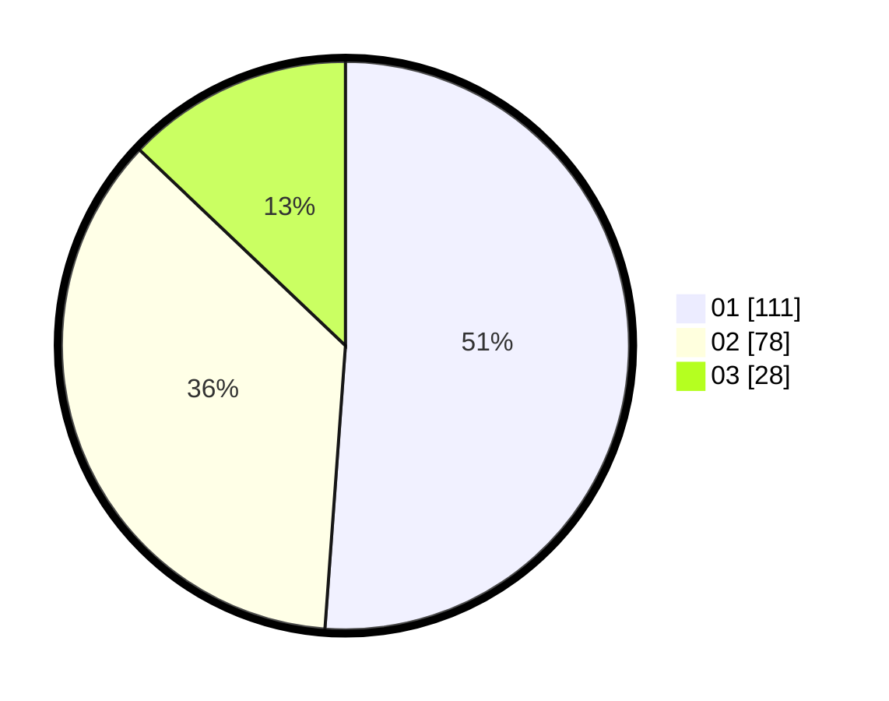

# Hasil

Hasil perolehan suara paslon dapat dilihat pada file paslon-01.txt, paslon-02.txt, dan paslon-03.txt.

Jika tidak ada, artinya data tersebut belum ada pada SIREKAP.

## Perolehan Suara

 * Paslon 01: **111**.
 * Paslon 02: **78**.
 * Paslon 03: **28**.

## Foto C Plano

https://sirekap-obj-formc.kpu.go.id/1357/pemilu/ppwp/31/74/01/10/03/3174011003072-20240214-175845--fb309b9c-3c17-4903-a626-f29dfdb2b4cd.jpg

https://sirekap-obj-formc.kpu.go.id/1357/pemilu/ppwp/31/74/01/10/03/3174011003072-20240214-184742--3385df1f-4a9b-4ab4-8fb2-6cc9326035f3.jpg

https://sirekap-obj-formc.kpu.go.id/1357/pemilu/ppwp/31/74/01/10/03/3174011003072-20240214-184752--d308897a-7912-41fe-a979-a1e549de84c9.jpg

## DATA PEMILIH TETAP

Jumlah pemilih dalam DPT: **256**.
 * L: **129**.
 * P: **127**.

## DATA PENGGUNA HAK PILIH

Jumlah pengguna hak pilih dalam DPT: **217**.
 * L: **106**.
 * P: **111**.

Jumlah pengguna hak pilih dalam DPTb: **1**.
 * L: **1**.
 * P: **0**.

Jumlah pengguna hak pilih dalam DPK: **0**.
 * L: **0**.
 * P: **0**.

Jumlah pengguna hak pilih: **218**.
 * L: **107**.
 * P: **111**.

## JUMLAH SUARA SAH DAN TIDAK SAH

JUMLAH SELURUH SUARA SAH: **217**.

JUMLAH SUARA TIDAK SAH: **1**.

JUMLAH SELURUH SUARA SAH DAN SUARA TIDAK SAH: **218**.
