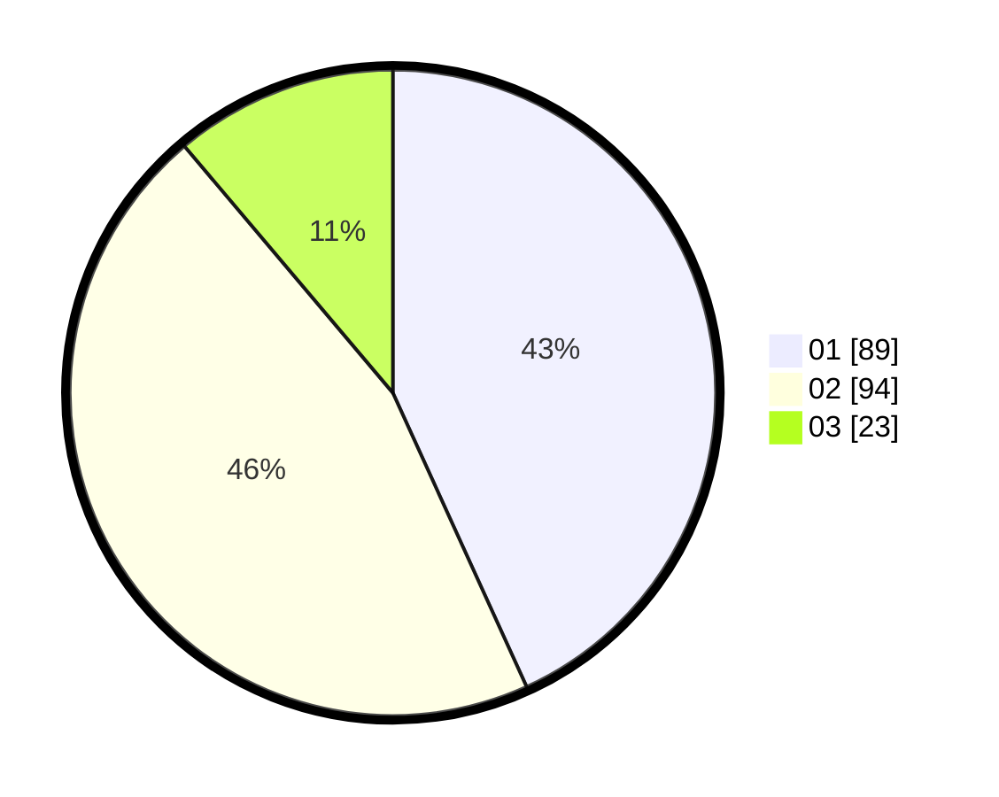

# Hasil

Hasil perolehan suara paslon dapat dilihat pada file paslon-01.txt, paslon-02.txt, dan paslon-03.txt.

Jika tidak ada, artinya data tersebut belum ada pada SIREKAP.

## Perolehan Suara

 * Paslon 01: **89**.
 * Paslon 02: **94**.
 * Paslon 03: **23**.

## Foto C Plano

https://sirekap-obj-formc.kpu.go.id/0469/pemilu/ppwp/31/74/01/10/03/3174011003077-20240214-194639--4d0e6261-8a0a-437a-9a0f-aefb8575e65b.jpg

https://sirekap-obj-formc.kpu.go.id/0469/pemilu/ppwp/31/74/01/10/03/3174011003077-20240214-193551--06df9b71-bd2a-4bb8-88fa-243f24f7a820.jpg

https://sirekap-obj-formc.kpu.go.id/0469/pemilu/ppwp/31/74/01/10/03/3174011003077-20240214-193937--088572ec-cd75-4090-a3d3-f28c9bc8a5f8.jpg

## DATA PEMILIH TETAP

Jumlah pemilih dalam DPT: **258**.
 * L: **127**.
 * P: **131**.

## DATA PENGGUNA HAK PILIH

Jumlah pengguna hak pilih dalam DPT: **200**.
 * L: **92**.
 * P: **108**.

Jumlah pengguna hak pilih dalam DPTb: **0**.
 * L: **0**.
 * P: **0**.

Jumlah pengguna hak pilih dalam DPK: **6**.
 * L: **2**.
 * P: **4**.

Jumlah pengguna hak pilih: **206**.
 * L: **94**.
 * P: **112**.

## JUMLAH SUARA SAH DAN TIDAK SAH

JUMLAH SELURUH SUARA SAH: **206**.

JUMLAH SUARA TIDAK SAH: **0**.

JUMLAH SELURUH SUARA SAH DAN SUARA TIDAK SAH: **206**.
