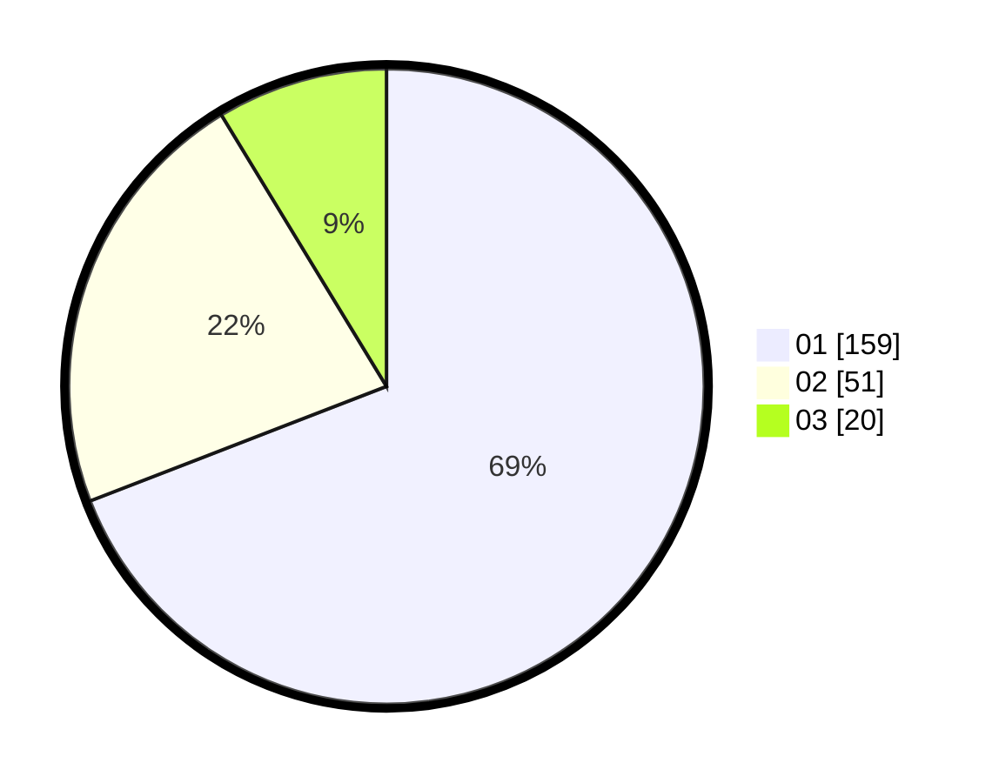

# Hasil

Hasil perolehan suara paslon dapat dilihat pada file paslon-01.txt, paslon-02.txt, dan paslon-03.txt.

Jika tidak ada, artinya data tersebut belum ada pada SIREKAP.

## Perolehan Suara

 * Paslon 01: **159**.
 * Paslon 02: **51**.
 * Paslon 03: **20**.

## Foto C Plano

https://sirekap-obj-formc.kpu.go.id/f177/pemilu/ppwp/31/74/01/10/03/3174011003086-20240215-220147--1d2ed911-d25d-4bfc-ab3a-9637587e26d2.jpg

https://sirekap-obj-formc.kpu.go.id/f177/pemilu/ppwp/31/74/01/10/03/3174011003086-20240215-220150--5ce3915c-c47b-4c40-87e8-3f5475c3ff14.jpg

https://sirekap-obj-formc.kpu.go.id/f177/pemilu/ppwp/31/74/01/10/03/3174011003086-20240215-220148--fe5d9bef-1ce3-4a7d-90ba-280f1fcab87e.jpg

## DATA PEMILIH TETAP

Jumlah pemilih dalam DPT: **257**.
 * L: **122**.
 * P: **135**.

## DATA PENGGUNA HAK PILIH

Jumlah pengguna hak pilih dalam DPT: **222**.
 * L: **109**.
 * P: **113**.

Jumlah pengguna hak pilih dalam DPTb: **6**.
 * L: **1**.
 * P: **5**.

Jumlah pengguna hak pilih dalam DPK: **3**.
 * L: **2**.
 * P: **1**.

Jumlah pengguna hak pilih: **231**.
 * L: **112**.
 * P: **119**.

## JUMLAH SUARA SAH DAN TIDAK SAH

JUMLAH SELURUH SUARA SAH: **230**.

JUMLAH SUARA TIDAK SAH: **1**.

JUMLAH SELURUH SUARA SAH DAN SUARA TIDAK SAH: **231**.
