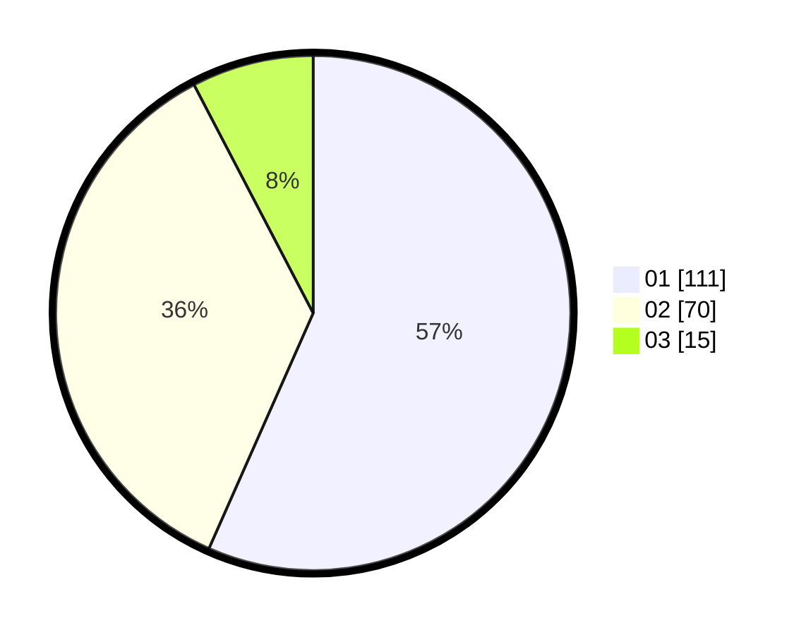

# Hasil

Hasil perolehan suara paslon dapat dilihat pada file paslon-01.txt, paslon-02.txt, dan paslon-03.txt.

Jika tidak ada, artinya data tersebut belum ada pada SIREKAP.

## Perolehan Suara

 * Paslon 01: **111**.
 * Paslon 02: **70**.
 * Paslon 03: **15**.

## Foto C Plano

https://sirekap-obj-formc.kpu.go.id/3e8d/pemilu/ppwp/31/74/01/10/03/3174011003091-20240214-192913--b6c4a85e-b3ab-4944-9c41-027495533601.jpg

https://sirekap-obj-formc.kpu.go.id/3e8d/pemilu/ppwp/31/74/01/10/03/3174011003091-20240214-192927--ceb98981-c4cb-48a9-9a0d-5dfb79f1204e.jpg

https://sirekap-obj-formc.kpu.go.id/3e8d/pemilu/ppwp/31/74/01/10/03/3174011003091-20240214-192935--901d7280-a7fb-4821-9281-1d811a34213a.jpg

## DATA PEMILIH TETAP

Jumlah pemilih dalam DPT: **256**.
 * L: **135**.
 * P: **121**.

## DATA PENGGUNA HAK PILIH

Jumlah pengguna hak pilih dalam DPT: **197**.
 * L: **100**.
 * P: **97**.

Jumlah pengguna hak pilih dalam DPTb: **2**.
 * L: **0**.
 * P: **2**.

Jumlah pengguna hak pilih dalam DPK: **0**.
 * L: **0**.
 * P: **0**.

Jumlah pengguna hak pilih: **199**.
 * L: **100**.
 * P: **99**.

## JUMLAH SUARA SAH DAN TIDAK SAH

JUMLAH SELURUH SUARA SAH: **196**.

JUMLAH SUARA TIDAK SAH: **3**.

JUMLAH SELURUH SUARA SAH DAN SUARA TIDAK SAH: **199**.
