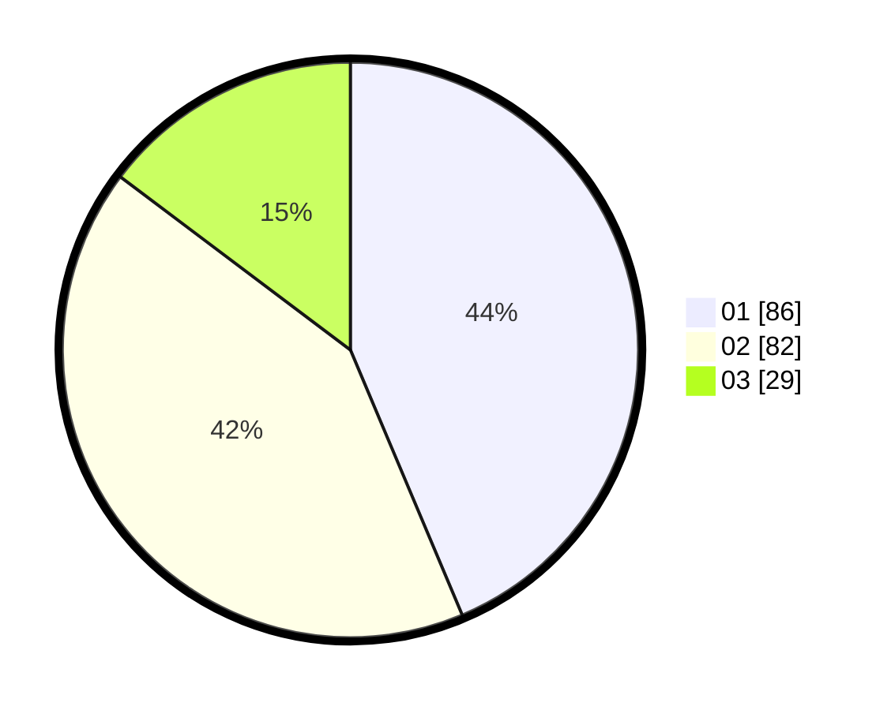

# Hasil

Hasil perolehan suara paslon dapat dilihat pada file paslon-01.txt, paslon-02.txt, dan paslon-03.txt.

Jika tidak ada, artinya data tersebut belum ada pada SIREKAP.

## Perolehan Suara

 * Paslon 01: **86**.
 * Paslon 02: **82**.
 * Paslon 03: **29**.

## Foto C Plano

https://sirekap-obj-formc.kpu.go.id/39cf/pemilu/ppwp/31/74/01/10/03/3174011003092-20240214-194152--0e1f723c-0be7-4705-b786-e923e1434126.jpg

https://sirekap-obj-formc.kpu.go.id/39cf/pemilu/ppwp/31/74/01/10/03/3174011003092-20240214-194207--2ea10ceb-4988-4e5c-a34a-75587b34a14b.jpg

https://sirekap-obj-formc.kpu.go.id/39cf/pemilu/ppwp/31/74/01/10/03/3174011003092-20240215-004701--1f67bbe0-c7cd-4fa4-bbe5-0efadd183787.jpg

## DATA PEMILIH TETAP

Jumlah pemilih dalam DPT: **243**.
 * L: **131**.
 * P: **112**.

## DATA PENGGUNA HAK PILIH

Jumlah pengguna hak pilih dalam DPT: **194**.
 * L: **104**.
 * P: **90**.

Jumlah pengguna hak pilih dalam DPTb: **5**.
 * L: **3**.
 * P: **2**.

Jumlah pengguna hak pilih dalam DPK: **1**.
 * L: **0**.
 * P: **1**.

Jumlah pengguna hak pilih: **200**.
 * L: **107**.
 * P: **93**.

## JUMLAH SUARA SAH DAN TIDAK SAH

JUMLAH SELURUH SUARA SAH: **197**.

JUMLAH SUARA TIDAK SAH: **3**.

JUMLAH SELURUH SUARA SAH DAN SUARA TIDAK SAH: **200**.
