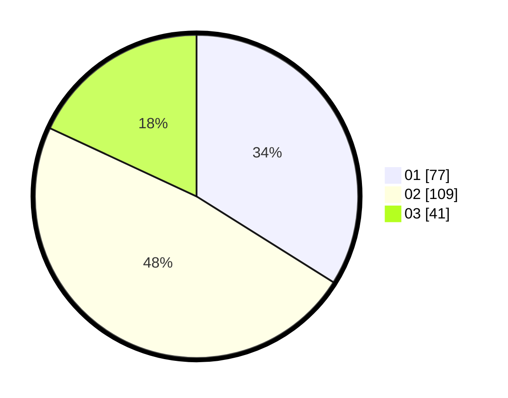

# Hasil

Hasil perolehan suara paslon dapat dilihat pada file paslon-01.txt, paslon-02.txt, dan paslon-03.txt.

Jika tidak ada, artinya data tersebut belum ada pada SIREKAP.

## Perolehan Suara

 * Paslon 01: **77**.
 * Paslon 02: **109**.
 * Paslon 03: **41**.

## Foto C Plano

https://sirekap-obj-formc.kpu.go.id/e0b8/pemilu/ppwp/31/74/01/10/03/3174011003094-20240215-001449--18b3ee5e-57b3-4cc2-9861-59c9725cf388.jpg

https://sirekap-obj-formc.kpu.go.id/e0b8/pemilu/ppwp/31/74/01/10/03/3174011003094-20240215-001918--0aab9c00-d2f3-4d00-8276-0209edaf8b59.jpg

https://sirekap-obj-formc.kpu.go.id/e0b8/pemilu/ppwp/31/74/01/10/03/3174011003094-20240215-002115--551c2700-942f-43ab-b775-b367701e39bd.jpg

## DATA PEMILIH TETAP

Jumlah pemilih dalam DPT: **273**.
 * L: **125**.
 * P: **148**.

## DATA PENGGUNA HAK PILIH

Jumlah pengguna hak pilih dalam DPT: **203**.
 * L: **94**.
 * P: **109**.

Jumlah pengguna hak pilih dalam DPTb: **15**.
 * L: **3**.
 * P: **12**.

Jumlah pengguna hak pilih dalam DPK: **11**.
 * L: **5**.
 * P: **6**.

Jumlah pengguna hak pilih: **229**.
 * L: **102**.
 * P: **127**.

## JUMLAH SUARA SAH DAN TIDAK SAH

JUMLAH SELURUH SUARA SAH: **227**.

JUMLAH SUARA TIDAK SAH: **2**.

JUMLAH SELURUH SUARA SAH DAN SUARA TIDAK SAH: **229**.
